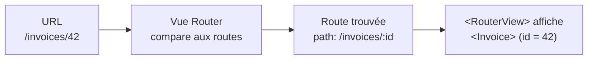

# Vue Router

Une SPA (*Single-Page Application*) n'a qu'**une** page HTML, mais l'utilisateur veut
naviguer entre plusieurs « écrans ». Vue Router fait le lien : il associe des **URLs** à
des **composants** (les « pages »), sans jamais recharger la page.

> **Pourquoi un routeur, au fond ?** En rendu serveur classique (PHP/Symfony), chaque URL
> déclenche une **requête** : le serveur choisit un contrôleur, génère le HTML, le renvoie —
> la page « clignote » à chaque clic. Dans une SPA, le JavaScript reste chargé ; Vue Router
> **intercepte** les changements d'URL et échange le composant affiché *sans* aller-retour
> serveur. Résultat : navigation instantanée, état conservé. C'est le cœur de ce qui
> distingue une SPA d'un site multi-pages.



> **Passerelle — routing serveur.** La table `routes` ci-dessous est l'exact pendant de la
> config de routes de Symfony/Laravel (`#[Route('/invoices/{id}')]`), ou du `routes.py` d'un
> FastAPI/Django. Même idée : *un motif d'URL → un « handler »*. La différence est **où** ça
> tourne : côté serveur, ça choisit un contrôleur ; côté Vue, ça choisit un **composant** à
> afficher dans le navigateur.

## Définir les routes

```js
import { createRouter, createWebHistory } from 'vue-router'

const routes = [
  { path: '/', component: Home },
  { path: '/invoices/:id', component: Invoice },   // :id = paramètre dynamique
]

export default createRouter({ history: createWebHistory(), routes })
```

Le `:id` est un **paramètre** : `/invoices/42` et `/invoices/7` mènent au même composant,
qui lira l'id pour savoir quoi afficher.

## Naviguer

Deux façons : **déclarative** (un lien dans le template) ou **programmatique** (en JS,
après une action) :

```vue
<RouterLink to="/invoices/42">Voir</RouterLink>   <!-- déclaratif -->
```

```js
import { useRouter, useRoute } from 'vue-router'

const router = useRouter()
router.push('/invoices/42')          // navigation programmatique

const route = useRoute()
route.params.id                       // '42' — lire le paramètre d'URL
```

Retiens la paire : **`useRouter()`** pour *agir* (naviguer), **`useRoute()`** pour *lire*
la route courante (params, query…).

## Garde de navigation

Pour protéger une route (authentification, par exemple), on intercepte **avant** d'y aller :

```js
router.beforeEach((to) => {
  if (to.meta.auth && !isAuthenticated()) return '/login'
})
```

> **Passerelle — middleware serveur.** Une garde de navigation, c'est un **middleware** :
> le pendant client d'un `AuthMiddleware` Symfony/Laravel ou d'une dépendance FastAPI qui
> vérifie le token avant d'exécuter la route. Même rôle : filtrer l'accès avant d'atteindre
> la « page ». (À noter : une garde côté client est du confort UX — la vraie sécurité reste
> côté serveur.)

> **Repère —** `<RouterView>` est l'emplacement où la page courante s'affiche (le « trou »
> qu'on remplit) ; `<RouterLink>` remplace `<a>` pour naviguer **sans recharger** la page.

## À retenir

- **Vue Router** associe une **URL** à un **composant**, sans recharger la page (cœur d'une
  SPA) — le pendant client du routing serveur.
- Un `:param` dans le `path` est un **paramètre dynamique**, lu via `useRoute().params`.
- Naviguer : **`<RouterLink>`** (déclaratif) ou **`useRouter().push()`** (programmatique).
- Une **garde** (`beforeEach`) filtre l'accès avant d'atteindre une route — un middleware
  côté client. `<RouterView>` = l'emplacement où la page s'affiche.
