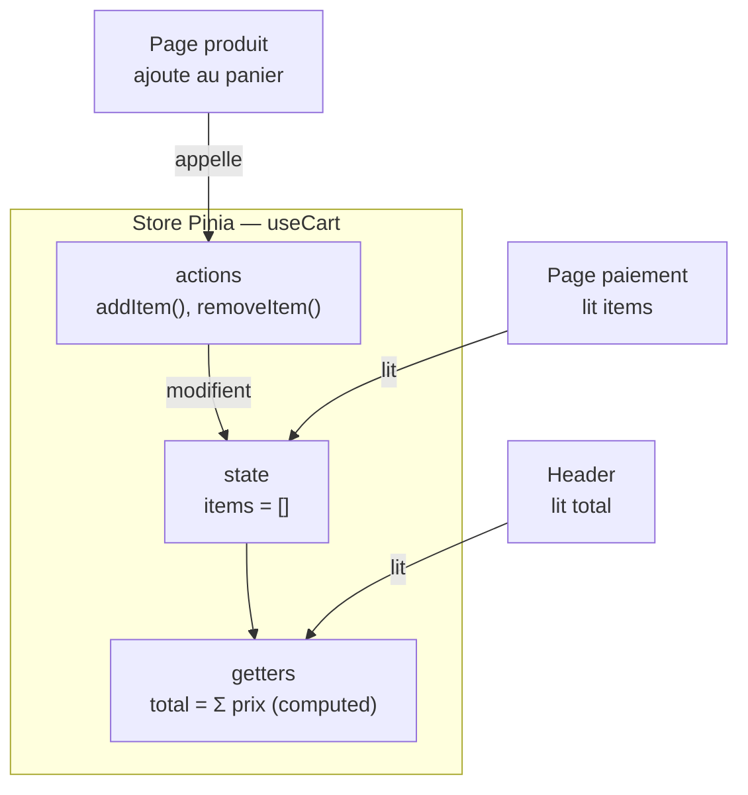

# Pinia

Quand plusieurs composants **sans lien parent/enfant** ont besoin du même état (le panier,
l'utilisateur connecté, le thème…), le faire transiter par props devient absurde : tu
passerais la donnée à travers dix composants intermédiaires qui ne s'en servent pas
(*prop-drilling*). La solution : un **store** Pinia, un état **global** que n'importe quel
composant lit et modifie directement.

> **Pourquoi un store plutôt que des props partout ?** Parce que certains états sont
> **transverses** : le panier concerne le header (badge), la page produit (bouton ajouter)
> et la page paiement (récap). Ces composants sont éloignés dans l'arbre. Un store leur
> donne **un point d'accès commun** — une seule source de vérité — au lieu d'un labyrinthe
> de props relayées.



## Définir un store

```js
import { defineStore } from 'pinia'
import { ref, computed } from 'vue'

export const useCart = defineStore('cart', () => {
  const items = ref([])
  const total = computed(() => items.value.reduce((sum, item) => sum + item.price, 0))

  function addItem(item) {
    items.value.push(item)
  }

  return { items, total, addItem }
})
```

Regarde bien : c'est **exactement la même API que `<script setup>`** — `ref` pour l'état,
`computed` pour le dérivé, des fonctions pour les actions. Si tu sais écrire un composant,
tu sais écrire un store. La seule différence : ce qu'on **retourne** ici est **partagé**
par tous les composants qui appellent `useCart()`.

Le vocabulaire Pinia pour ces trois briques :

- **state** (`ref`) : les données de vérité (ici `items`).
- **getters** (`computed`) : les valeurs **dérivées** de l'état (ici `total`).
- **actions** (fonctions) : les seules à **modifier** l'état (ici `addItem`).

> **Passerelle — data / SQL.** Un store, c'est un mini modèle de données en mémoire : le
> **state** = les tables, les **getters** = des vues (`computed`, dérivé, jamais dupliqué),
> les **actions** = les opérations autorisées (`INSERT`/`UPDATE`). On centralise l'état et
> ses règles au même endroit, comme une couche « repository ».

> **Passerelle — React / Angular.** Pinia joue le rôle de **Redux/Zustand** côté React ou
> d'un **service partagé** (singleton injecté) côté Angular. Même but : sortir l'état
> transverse des composants pour le mettre dans un endroit unique et prévisible. Pinia est
> juste bien plus léger que Redux — pas de *reducers*, pas de *dispatch* : on écrit des
> fonctions normales.

## Utiliser le store

```vue
<script setup>
import { useCart } from '@/stores/cart'
const cart = useCart()
</script>

<template>
  <p>Total : {{ cart.total }} €</p>
  <button @click="cart.addItem({ price: 10 })">Ajouter</button>
</template>
```

> **Props ou store ?** Props pour la communication **locale** parent↔enfant. Store pour un
> état **transverse** (panier, utilisateur connecté, préférences) partagé par des composants
> éloignés. **N'en abuse pas** : tout n'a pas besoin d'être global — un état qui ne concerne
> qu'un composant et ses enfants directs reste en props/état local.

## À retenir

- Un **store Pinia** contient un état **global** partagé par des composants **éloignés** —
  la solution au *prop-drilling*.
- Trois briques : **state** (`ref`), **getters** (`computed`, dérivés), **actions**
  (fonctions qui modifient l'état). Même API qu'un `<script setup>`.
- C'est l'équivalent de Redux/Zustand (React) ou d'un service partagé (Angular), en plus léger.
- **Props pour le local, store pour le transverse** — et on n'abuse pas du global.
