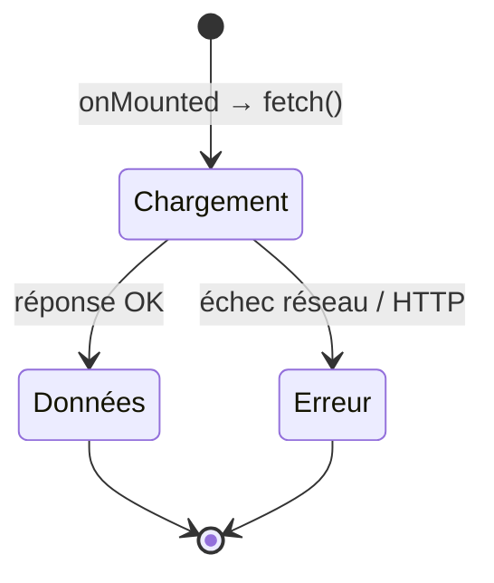

# Charger des données proprement

Dès qu'un composant va chercher ses données sur une API, il faut composer avec le **temps** :
la réponse n'arrive pas tout de suite, et elle peut **échouer**. Le pattern incontournable :
gérer **trois états** — **chargement**, **erreur**, **données**.

> **Pourquoi trois états et pas juste « les données » ?** Parce qu'entre le moment où tu
> demandes et le moment où tu reçois, il se passe un délai (réseau, serveur). Si tu affiches
> la liste sans gérer l'attente, l'utilisateur voit un écran vide et croit que c'est cassé.
> Et si le serveur renvoie une erreur (500, hors-ligne…), un composant qui suppose « les
> données arrivent toujours » **plante**. Les trois états rendent l'attente et l'échec
> **visibles et gérés**.



> 🧠 **Rappel algo.** Une opération asynchrone est une **machine à états** : on part de
> `Chargement`, et on transite vers `Données` **ou** `Erreur`, jamais les deux. Le `try /
> catch / finally` du code ci-dessous **encode** exactement cette machine : `try` = chemin
> succès, `catch` = transition vers l'erreur, `finally` = « dans tous les cas, on a fini de
> charger ». C'est le même schéma qu'une *promise* (`pending → fulfilled | rejected`).

```vue
<script setup>
import { ref, onMounted } from 'vue'

const users = ref([])
const loading = ref(true)
const error = ref(null)

onMounted(async () => {
  try {
    const res = await fetch('/api/users')
    if (!res.ok) throw new Error('HTTP ' + res.status)
    users.value = await res.json()
  } catch (e) {
    error.value = e.message
  } finally {
    loading.value = false
  }
})
</script>

<template>
  <p v-if="loading">Chargement…</p>
  <p v-else-if="error" class="err">{{ error }}</p>
  <ul v-else>
    <li v-for="u in users" :key="u.id">{{ u.name }}</li>
  </ul>
</template>
```

Le template lit la machine à états dans l'ordre : **si** on charge → spinner ; **sinon si**
erreur → message ; **sinon** → les données. Un seul de ces trois s'affiche à la fois.

> **Note — pas de bouton « Tester » ici.** Cet exemple appelle une vraie API (`/api/users`)
> qui n'existe pas dans le playground : on ne le rend donc **pas** exécutable (il ne
> simulerait rien de réel). Retiens plutôt la **structure** ; les composants exécutables du
> projet Todo-list (étape suivante) te feront pratiquer la réactivité en direct.

> **Passerelle — appels HTTP côté serveur.** Ce `fetch` + `try/catch` est le pendant client
> d'un client HTTP côté serveur (Guzzle en PHP, `requests`/`httpx` en Python) : mêmes
> précautions — vérifier le code de statut (`res.ok`), parser le corps, capturer l'échec
> réseau. La nouveauté côté Vue, c'est de **relier ces trois états au rendu** en temps réel.

> **Bonne pratique —** extrais ce pattern dans un **composable** `useFetch(url)` qui renvoie
> `{ data, loading, error }`. Tu le réutilises partout (souviens-toi de la leçon
> composables), et tes composants restent concentrés sur l'affichage.

> **Piège —** toujours gérer l'**erreur** et l'état **loading**. Un composant qui suppose
> que les données arrivent toujours, instantanément et sans échec, casse en production dès
> la première coupure réseau.

## À retenir

- Charger des données = gérer **trois états** : **loading**, **error**, **data** (une
  machine à états `pending → fulfilled | rejected`).
- Le trio **`try` / `catch` / `finally`** encode ces transitions : succès / échec / « fini
  de charger dans tous les cas ».
- Le template affiche **un seul** état à la fois via `v-if` / `v-else-if` / `v-else`.
- Factorise le pattern dans un **composable `useFetch`** ; ne jamais supposer que le réseau
  réussit toujours.
