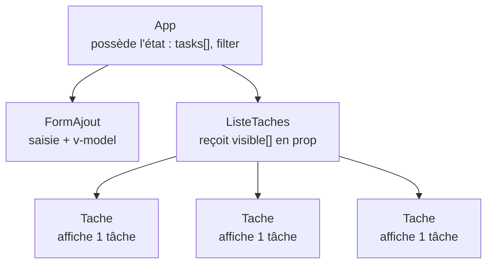
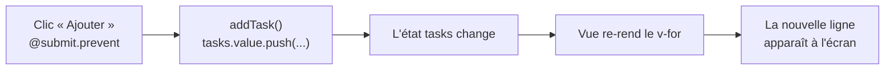

# Projet fil rouge : une Todo-list

Place à la pratique : on assemble tout ce qu'on a vu (réactivité, `v-for`, `v-model`,
`computed`, événements) pour construire une **vraie petite application**. La todo-list est
le « projet-école » par excellence — elle touche à *tous* les fondamentaux sans se noyer
dans la complexité.

> **Comment suivre —** chaque étape donne un composant **complet et exécutable**. Survole le
> bloc de code et clique **« Tester »** : il s'ouvre dans le playground, tu le fais tourner
> et tu **expérimentes** en le modifiant. C'est en bidouillant qu'on apprend.

## L'architecture qu'on vise

Au fil des étapes, l'appli va se structurer en un petit **arbre de composants** : un parent
qui orchestre, des enfants focalisés. Voici la cible (tu la construiras vraiment à l'étape
« À toi de jouer ») :

## Ce qui se passe quand on clique « Ajouter »

Garde ce flux en tête — c'est **la boucle réactive** vue au module 3, appliquée à un vrai
geste utilisateur :

> 🧠 **Rappel algo.** Tu ne manipules **jamais** le DOM à la main (« ajoute un `<li>` »). Tu
> modifies **l'état** (`tasks`), et le rendu en découle. C'est le renversement clé de Vue :
> *les données sont la source de vérité, l'affichage n'en est que le reflet.* Tout le projet
> repose sur ce principe.

## Ce qu'on va construire, étape par étape

1. **Afficher** la liste des tâches (`v-for`)
2. **Ajouter** une tâche (`v-model` + événement)
3. **Cocher** et **supprimer** une tâche
4. **Filtrer** (toutes / actives / faites) + compteur

À la fin, tu repars avec un projet à **étendre toi-même** dans ton atelier perso
(le bouton flottant **« Vue »** — ton code y est **sauvegardé**).
