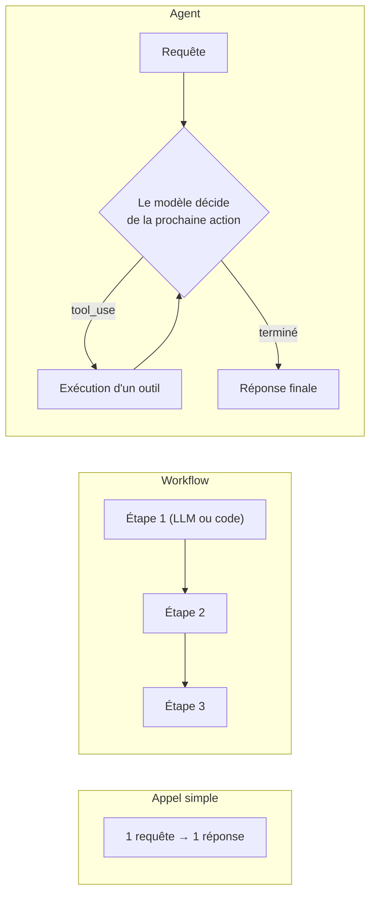

# Le premier réflexe : ai-je vraiment besoin d'un agent ?

Ce module pèse **27 % de l'examen** CCDV-F/CCA-F — le domaine le plus lourd. Le piège central, répété dans presque tous les scénarios : construire un agent (boucle autonome, plusieurs outils, plusieurs allers-retours) là où un simple appel ou un **workflow déterministe** suffisait. L'examen teste ta capacité à **résister à l'over-engineering**, pas ta capacité à construire l'architecture la plus impressionnante.

> **Repère pour un dev Symfony —** pense à la différence entre un `Command` Symfony qui exécute une séquence fixe d'étapes (un *workflow*) et un service qui interroge dynamiquement une source de vérité pour décider de la prochaine étape à chaque itération (un *agent*). Le premier est prévisible et bon marché à auditer ; le second est plus flexible mais plus difficile à borner.

## Les trois niveaux, du plus simple au plus autonome

- **Appel simple** — une passe unique : prompt → réponse. Le chemin est fixe, il n'y a ni outil ni boucle. Adapté à la classification, l'extraction, la reformulation, le résumé.
- **Workflow** — une **séquence prédéfinie** d'étapes (appels LLM et/ou code classique), orchestrée par **toi**. Le chemin peut bifurquer (`if/else`), mais il est connu à l'avance. Adapté quand la tâche se décompose en étapes connues et stables (ex. extraire → valider → enrichir → sauvegarder).
- **Agent** — une **boucle** où c'est le **modèle** qui décide, à chaque itération, quel outil appeler ensuite, en fonction de ce qu'il vient d'observer. Adapté quand le chemin ne peut pas être connu à l'avance (le nombre d'étapes et leur ordre dépendent du contenu découvert en cours de route).

## Les quatre critères de décision

| Critère | Question à se poser |
|---|---|
| **Complexité de la tâche** | Le chemin de résolution est-il connu à l'avance (workflow) ou dépend-il du contenu découvert en cours de route (agent) ? |
| **Valeur de l'autonomie** | Le gain de flexibilité justifie-t-il la perte de prévisibilité et d'auditabilité ? |
| **Viabilité économique** | Le coût (tokens, latence, plusieurs allers-retours) est-il justifié par la valeur produite pour cette tâche précise ? |
| **Coût d'une erreur** | Une erreur est-elle bénigne et réversible (reformulation, brouillon) ou coûteuse et irréversible (action sur un système de prod, transaction financière, suppression) ? Plus le coût d'erreur est élevé, plus on borne l'autonomie (validation humaine, workflow plutôt qu'agent libre). |

> 🎯 **Piège d'examen —** un scénario décrit une tâche simple et bien définie (« résumer ce texte », « extraire ces champs d'un email ») habillée dans un contexte « agentique » impressionnant (plusieurs outils listés, un système multi-étapes). La bonne réponse est presque toujours la solution **la plus simple qui couvre le besoin** — un appel simple ou un workflow — pas un agent complet avec boucle autonome. L'examen sanctionne l'over-engineering autant qu'il sanctionne la sous-ingénierie.

> 🎯 **Piège d'examen —** à l'inverse, un scénario où le nombre d'étapes et leur nature ne peuvent **pas** être connus à l'avance (ex. « corrige ce bug, je ne sais pas combien de fichiers sont concernés ni lesquels ») signale un besoin réel d'agent : c'est le modèle qui doit explorer et décider, pas un workflow figé.

## À retenir

- Trois niveaux : appel simple (1 passe), workflow (séquence connue, orchestrée par toi), agent (boucle où le modèle décide de la suite).
- Quatre critères de choix : complexité du chemin, valeur de l'autonomie, viabilité économique, coût d'une erreur.
- Le réflexe d'examen : partir du **plus simple** ; ne monter en autonomie que si le chemin de résolution n'est réellement pas connaissable à l'avance.
