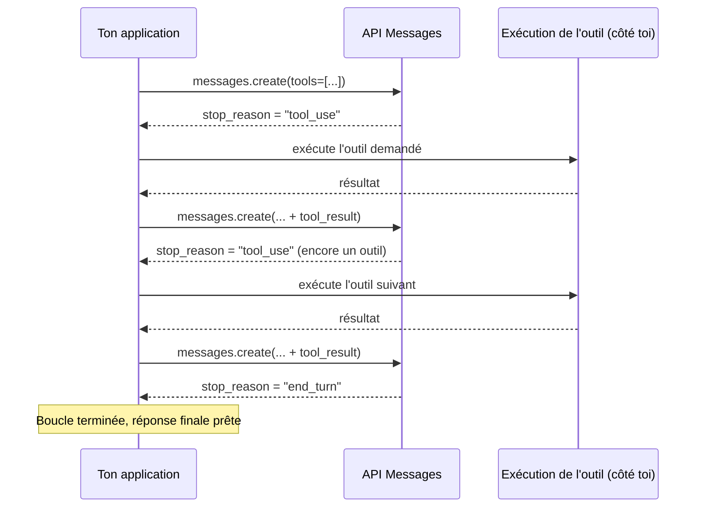

# Anatomie de la boucle agentique

Une fois qu'on a décidé qu'un agent est justifié (leçon précédente), il faut savoir **comment** la boucle fonctionne au niveau de l'API Messages — c'est le mécanisme que tout le reste du domaine 1 suppose acquis.

## Le cycle requête → outil → résultat → boucle



À chaque itération : le modèle reçoit l'historique complet (y compris les `tool_result` précédents), décide s'il a besoin d'un outil, et répond soit avec un bloc `tool_use` (l'exécution t'est déléguée), soit avec du texte final. **C'est toujours ton code qui exécute l'outil** — l'API ne fait qu'indiquer quel outil appeler avec quels paramètres.

## Les stop_reason à connaître

Le champ `stop_reason` de chaque réponse indique **pourquoi** le modèle s'est arrêté de générer. C'est lui qui pilote la logique de ta boucle.

| `stop_reason` | Signification | Action attendue |
|---|---|---|
| `end_turn` | Le modèle a terminé naturellement sa réponse. | Utiliser la réponse telle quelle ; sortir de la boucle. |
| `tool_use` | Le modèle demande l'exécution d'un ou plusieurs outils. | Exécuter le(s) outil(s), renvoyer le(s) `tool_result`, relancer un appel. |
| `max_tokens` | La réponse a été **tronquée** par la limite `max_tokens`. | Ce n'est **pas** une fin normale : augmenter `max_tokens` ou renvoyer la réponse partielle pour continuation. Ne jamais traiter le contenu comme complet. |
| `pause_turn` | Une boucle d'**outil serveur** (ex. recherche web multi-étapes gérée par Anthropic) a atteint sa limite d'itérations internes. | Renvoyer le contenu assistant tel quel dans un nouvel appel pour laisser la boucle continuer — ce n'est pas une erreur, juste un point de reprise. |
| `refusal` | Le modèle a décliné de répondre. | Lire les détails du refus ; éventuellement retenter sur un modèle de repli. |

> 🎯 **Piège d'examen —** `max_tokens` et `pause_turn` sont fréquemment confondus car les deux « arrêtent » la génération en cours de tâche. Mais leur traitement diffère structurellement : `max_tokens` signale une **troncature** (il manque du contenu, il faut agrandir la limite ou reprendre) tandis que `pause_turn` signale un **point de reprise volontaire** d'une boucle d'outil serveur (il faut simplement relancer l'appel avec le même contenu pour que la boucle continue). Traiter un `pause_turn` comme une erreur, ou un `max_tokens` comme une fin normale, sont deux erreurs classiques de l'examen.

Le tableau ci-dessus couvre les `stop_reason` les plus fréquents à l'examen ; deux autres valeurs existent dans la documentation (7 au total) : **`stop_sequence`** (Claude a émis l'une des séquences d'arrêt personnalisées passées en paramètre) et **`model_context_window_exceeded`** (la réponse a rempli toute la fenêtre de contexte du modèle — à traiter comme une troncature, au même titre que `max_tokens`).

## Boucle manuelle minimale (Python)

```python
import anthropic

client = anthropic.Anthropic()

def run_tool(name: str, tool_input: dict) -> str:
    # Dispatch to your own tool implementations
    if name == "get_order_status":
        return f"Order {tool_input['order_id']} is shipped"
    raise ValueError(f"Unknown tool: {name}")

messages = [{"role": "user", "content": "What is the status of order #4821?"}]
tools = [
    {
        "name": "get_order_status",
        "description": "Look up the shipping status of an order by id",
        "input_schema": {
            "type": "object",
            "properties": {"order_id": {"type": "string"}},
            "required": ["order_id"],
        },
    }
]

max_iterations = 6
for _ in range(max_iterations):
    response = client.messages.create(
        model="claude-opus-4-8",
        max_tokens=1024,
        tools=tools,
        messages=messages,
    )
    messages.append({"role": "assistant", "content": response.content})

    if response.stop_reason != "tool_use":
        break  # end_turn, refusal, max_tokens: exit the loop and handle accordingly

    tool_results = []
    for block in response.content:
        if block.type == "tool_use":
            result_text = run_tool(block.name, block.input)
            tool_results.append(
                {"type": "tool_result", "tool_use_id": block.id, "content": result_text}
            )
    messages.append({"role": "user", "content": tool_results})
else:
    raise RuntimeError("Max iterations reached without end_turn")
```

## Anti-boucles : borner l'autonomie

Un agent livré à lui-même peut boucler indéfiniment (outil qui échoue en boucle, plan qui ne converge pas). Trois garde-fous structurels, à connaître pour l'examen :

- **`max_iterations`** — une limite dure sur le nombre de tours de boucle (comme le `for` de l'exemple ci-dessus). C'est la protection de premier niveau, toujours présente.
- **Replanification** — si l'agent échoue plusieurs fois sur la même approche, forcer un point de réflexion explicite (« ton plan actuel échoue, reconsidère ton approche ») plutôt que de le laisser retenter indéfiniment la même action.
- **Escalade humaine** — au-delà d'un certain nombre de tentatives, ou face à une action à fort coût d'erreur (leçon précédente), interrompre la boucle et remonter à un humain plutôt que de laisser l'agent décider seul.

> 🎯 **Piège d'examen —** un scénario qui décrit un agent « qui tourne en boucle sur la même erreur » attend une réponse **structurelle** (ajouter un `max_iterations`, déclencher une replanification, escalader) — pas un ajustement de prompt du type « demande-lui d'être plus prudent ».

## À retenir

- La boucle : requête → (`tool_use` ?) → exécution **côté toi** → `tool_result` → nouvel appel → jusqu'à `end_turn`.
- `stop_reason` pilote la logique : `end_turn` (fini), `tool_use` (exécuter et boucler), `max_tokens` (troncature, pas une fin normale), `pause_turn` (reprise d'une boucle d'outil serveur), `refusal` (décliné).
- Bornes anti-boucle : `max_iterations` (toujours), replanification (échecs répétés), escalade humaine (coût d'erreur élevé ou tentatives épuisées).
