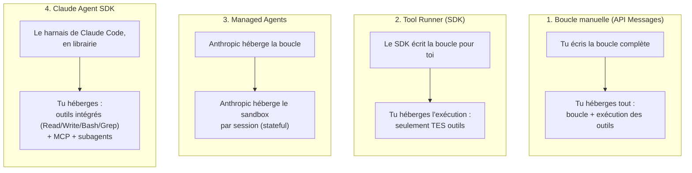

# Le tableau que l'examen attend de toi

C'est **le** concept charnière du domaine 1 (et sans doute de tout l'examen) : Anthropic propose **quatre façons distinctes** de construire un agent, qui se distinguent sur deux axes structurels :

- **Qui écrit/héberge la boucle agentique** (le code qui appelle l'API, interprète `stop_reason`, exécute les outils) ?
- **Qui héberge l'exécution** (le sandbox où tournent les outils — fichiers, bash, etc.) ?

Confondre ces quatre options est le piège n°1 de l'examen sur ce domaine : les questions sont souvent des choix structurels entre deux de ces options qui se ressemblent en surface.

## Les 4 options

| Option | Qui écrit la boucle ? | Qui héberge l'exécution ? | Outils fournis | Cas d'usage typique |
|---|---|---|---|---|
| **1. Boucle manuelle sur l'API Messages** | Toi (le `while`/`for` qui lit `stop_reason` et boucle) | Toi | Aucun par défaut : uniquement ceux que tu définis et exécutes | Contrôle fin, cas simples, besoin de logique métier précise à chaque itération |
| **2. Tool Runner (SDK)** | Le SDK (helper bêta qui gère la boucle, le typage, le wrapping d'erreurs à ta place) | Toi | Uniquement **tes** outils (déclarés via le SDK, ex. `@beta_tool` en Python) | Tu veux déléguer la mécanique de boucle, mais garder un contrôle total sur les outils exposés, sans outils intégrés |
| **3. Managed Agents** | **Anthropic** (harnais hébergé, tu envoies des événements) | **Anthropic** (sandbox cloud managé, ou sandbox auto-hébergé) — état persistant **par session** | Bash, opérations fichiers, recherche web, MCP | Tâches longues (minutes/heures), asynchrones, sans vouloir construire/maintenir ta propre infra de sandbox ; agents créés une fois, référencés par ID, réutilisables entre sessions |
| **4. Claude Agent SDK** | Le harnais **de Claude Code**, en librairie (le même moteur qui fait tourner Claude Code) | Toi | Outils intégrés (Read, Write, Bash, Grep, etc.) **+ MCP + sous-agents** — un harnais complet, pas juste une boucle | Construire ton propre agent de type « Claude Code » (coding agent, agent d'infra) avec tous les outils déjà prêts, hébergé sur ton infra |

> 🎯 **Piège d'examen —** Tool Runner (option 2) et Claude Agent SDK (option 4) sont les deux options les plus confondues : les deux sont des **bibliothèques que tu héberges toi-même**. La différence structurelle : le Tool Runner ne fait que gérer la **mécanique de la boucle** (tu dois quand même écrire et exposer tes propres outils, il n'y a aucun outil intégré) ; le Claude Agent SDK fournit le **harnais complet de Claude Code** — outils système intégrés (fichiers, bash), intégration MCP, et sous-agents prêts à l'emploi. Un scénario qui demande « je veux réutiliser les capacités de Claude Code (lire/écrire des fichiers, exécuter des commandes) dans mon propre produit » pointe vers le **Claude Agent SDK**, pas le Tool Runner.

> 🎯 **Piège d'examen —** un scénario qui insiste sur « je ne veux pas construire ni maintenir mon infrastructure de sandbox, la tâche peut durer plusieurs heures, je veux reprendre une session interrompue » pointe vers **Managed Agents** — c'est le seul des 4 où **Anthropic héberge à la fois la boucle et l'environnement d'exécution**, avec un état persistant par session. Une réponse qui propose une boucle manuelle ou le Tool Runner dans ce contexte ignore que le candidat devrait alors construire lui-même le sandbox, la persistance et la reprise après interruption.

## Repère rapide : la question à se poser

Pour trancher entre les 4 options face à un scénario d'examen, poser dans l'ordre :

1. **Ai-je besoin des outils intégrés de Claude Code (fichiers, bash) et de sous-agents ?** → Claude Agent SDK.
2. **Ai-je besoin qu'Anthropic héberge aussi le sandbox d'exécution (tâches longues/asynchrones, pas d'infra à maintenir) ?** → Managed Agents.
3. **Ai-je seulement besoin de la mécanique de boucle, avec mes propres outils, sans rien de plus ?** → Tool Runner du SDK.
4. **Ai-je besoin d'un contrôle total, ligne par ligne, sur chaque itération ?** → boucle manuelle sur l'API Messages.

## À retenir

- 4 options, 2 axes : qui écrit la boucle, qui héberge l'exécution.
- Boucle manuelle : tu écris et héberges tout.
- Tool Runner : le SDK écrit la boucle, tu héberges l'exécution de **tes seuls** outils.
- Managed Agents : Anthropic héberge la boucle **et** le sandbox, agents persistés/versionnés par ID, sessions à état.
- Claude Agent SDK : le harnais complet de Claude Code en librairie (outils intégrés + MCP + sous-agents), hébergé par toi.
