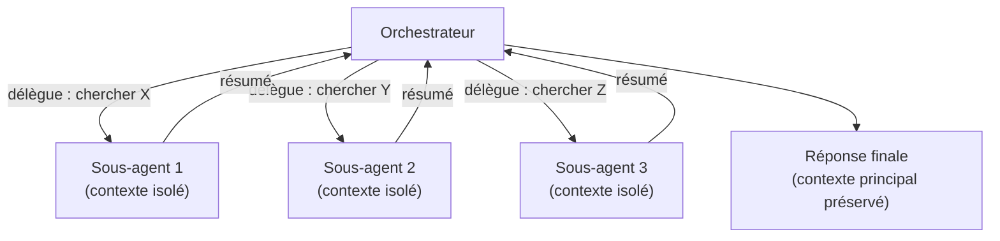

# Un orchestrateur, des sous-agents

Au-delà d'un agent unique, un pattern récurrent de l'examen : un **orchestrateur** qui délègue des sous-tâches à des **sous-agents** (subagents), chacun avec son propre contexte, ses propres outils, et qui renvoie un résultat condensé à l'orchestrateur.

## Pourquoi isoler un sous-agent : le contexte, pas la « spécialisation »

La bonne raison structurelle de déléguer à un sous-agent, c'est la **gestion du contexte** : une sous-tâche qui produirait beaucoup de contenu intermédiaire (résultats de recherche, logs, contenu de fichiers) que l'orchestrateur n'a **pas besoin de garder** au-delà du résumé final. Le sous-agent absorbe ce volume dans **sa propre fenêtre de contexte**, isolée, et ne renvoie que l'essentiel.

> 🎯 **Piège d'examen —** déléguer à un sous-agent une tâche **fortement couplée** au fil de la conversation principale (qui a besoin de tout le contexte déjà accumulé, et dont le résultat détaillé sera réutilisé dans les tours suivants) ajoute de la latence et de la complexité **sans bénéfice** : le sous-agent devrait recevoir un contexte qu'il n'a pas, ou l'orchestrateur devrait de toute façon réintégrer tout le détail perdu à l'isolation. Dans ce cas, la bonne réponse est de **travailler directement** dans le contexte principal, pas de déléguer.

## Séquentiel vs parallèle vs délégation asynchrone

| Pattern | Description | Cas d'usage |
|---|---|---|
| **Séquentiel** | Un sous-agent s'exécute, son résultat conditionne l'appel du suivant. | Les étapes dépendent les unes des autres (ex. chercher un fichier, puis l'analyser). |
| **Parallèle (fan-out)** | Plusieurs sous-agents s'exécutent en même temps sur des **items indépendants**. | Analyser N fichiers indépendants, résumer N documents séparés, chercher dans N sources sans dépendance entre elles. |
| **Délégation asynchrone** | L'orchestrateur lance un sous-agent en tâche de fond et continue (ou attend) sans bloquer le fil principal sur chaque étape intermédiaire. | Tâche longue dont le résultat n'est nécessaire qu'à la fin (ex. build, analyse volumineuse). |

> 🎯 **Piège d'examen —** un scénario qui décrit **plusieurs éléments indépendants à traiter** (« analyse chacun de ces 10 fichiers de log ») et propose un traitement **séquentiel** un par un est rarement optimal : la réponse structurelle attendue est le **fan-out parallèle** (un sous-agent par item indépendant), qui réduit la latence totale sans risque de conflit puisque les items ne dépendent pas les uns des autres.

## Sous-agent : contexte isolé, permissions restreintes

Un sous-agent n'hérite pas automatiquement de l'historique complet de la conversation principale : il reçoit une consigne ciblée (et éventuellement un jeu d'outils restreint). C'est ce qui permet de :

- **Préserver le contexte principal** — l'exploration volumineuse reste dans la fenêtre du sous-agent.
- **Restreindre les capacités** — un sous-agent de recherche peut n'avoir accès qu'à des outils de lecture, jamais d'écriture (voir module 2 sur les sous-agents personnalisés de Claude Code).
- **Paralléliser sans risque de conflit** — tant que les sous-tâches sont réellement indépendantes.

## Quand déléguer, quand travailler directement

- **Déléguer** quand : la sous-tâche produirait un volume de contexte inutile au-delà de son résultat, quand les items sont indépendants (fan-out), ou quand on veut restreindre les permissions d'une sous-tâche spécifique.
- **Travailler directement** quand : la tâche est petite, fortement couplée au contexte déjà présent, ou que le coût de délégation (latence, complexité de coordination) dépasse le bénéfice.

## À retenir

- La bonne raison de déléguer à un sous-agent : **isoler du contexte non réutilisé**, pas « faire plus agentique ».
- Fan-out parallèle pour des items indépendants ; séquentiel quand les étapes dépendent les unes des autres ; asynchrone quand le résultat n'est nécessaire qu'à la fin.
- Un sous-agent avec un contexte et des permissions restreintes réduit le risque et la charge cognitive de l'orchestrateur.
