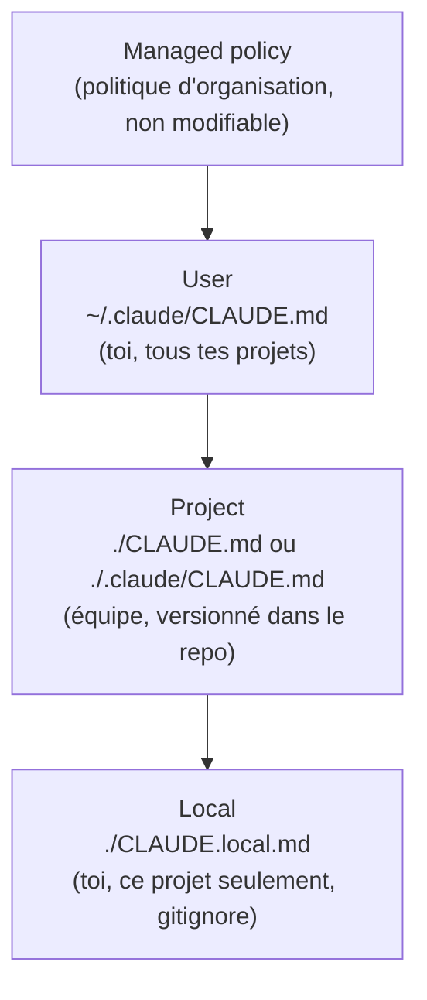

# Où écrire les instructions persistantes

Ce module pèse **20 % de l'examen**. Il porte sur la configuration de Claude Code — la question centrale est toujours **« à quelle portée (scope) placer cette instruction/config ? »**. `CLAUDE.md` est le premier mécanisme : des instructions persistantes, chargées à chaque session.

> **Repère —** `CLAUDE.md` fonctionne comme un fichier de configuration versionné (pense `.editorconfig` ou `phpstan.neon`) : plus il est proche du dépôt, plus il est partagé avec l'équipe ; plus il est proche de ta session personnelle, plus il te reste propre.

## Les quatre portées, de la plus large à la plus étroite

| Portée | Emplacement | Partagé avec | Cas d'usage |
|---|---|---|---|
| **Managed (politique)** | Déployé par l'organisation (IT/DevOps) | Toute l'organisation | Standards de sécurité/conformité imposés, non contournables |
| **User** | `~/.claude/CLAUDE.md` | Toi seul, tous tes projets | Préférences personnelles (style de code, raccourcis d'outillage) |
| **Project** | `./CLAUDE.md` ou `./.claude/CLAUDE.md` | L'équipe, via le contrôle de version | Architecture du projet, conventions, commandes de build/tests |
| **Local** | `./CLAUDE.local.md` | Toi seul, ce projet | URLs de sandbox personnelles, données de test — à ajouter au `.gitignore` |

Tous les fichiers découverts sont **concaténés** dans le contexte (pas de simple écrasement) : l'ordre va de la racine du filesystem vers le répertoire de travail, donc une instruction de projet apparaît **après** une instruction utilisateur — et à l'intérieur d'un même répertoire, le `CLAUDE.local.md` est ajouté en dernier.

> 🎯 **Piège d'examen —** une **skill ou une procédure d'équipe** (ex. « comment lancer les tests d'intégration de ce repo ») doit être versionnée en **portée projet** (`.claude/`, commit dans le repo) pour que toute l'équipe en bénéficie — jamais en portée utilisateur (`~/.claude/`), qui ne profiterait qu'à son auteur. À l'inverse, une préférence strictement personnelle (ex. « je préfère les commentaires en anglais dans mes commits ») reste en portée utilisateur, sinon elle pollue `CLAUDE.md` pour toute l'équipe.

## Écrire des instructions efficaces

`CLAUDE.md` est chargé en contexte à **chaque** session : chaque ligne coûte des tokens et peut diluer l'attention du modèle. Trois règles pratiques (souvent citées dans des scénarios d'examen sur la « qualité » d'un `CLAUDE.md`) :

- **Concis et concret** — préférer « lance `npm test` avant de committer » à « teste bien ton code ». Une instruction vérifiable vaut mieux qu'une instruction vague.
- **Taille maîtrisée** — un fichier qui grossit sans limite dilue son efficacité ; découper les procédures volumineuses en **skills** (chargées à la demande, voir leçon suivante) plutôt que de tout garder dans `CLAUDE.md` (chargé à chaque session, que ce soit utile ou non pour la tâche en cours).
- **Cohérence** — deux règles contradictoires dans des fichiers `CLAUDE.md` empilés (projet + local) forcent le modèle à arbitrer arbitrairement.

> 🎯 **Piège d'examen —** un scénario décrit un `CLAUDE.md` de 800 lignes qui contient à la fois des standards globaux et le détail pas-à-pas d'une procédure de déploiement rarement utilisée. La bonne réponse structurelle est de **déplacer la procédure vers une skill** (chargée seulement quand invoquée) et de garder dans `CLAUDE.md` uniquement les faits nécessaires à **toutes** les sessions — pas de simplement « raccourcir le texte » en gardant tout au même endroit.

## À retenir

- 4 portées : managed (org) > user (`~/.claude/CLAUDE.md`) > project (`./CLAUDE.md`, versionné) > local (`CLAUDE.local.md`, gitignore).
- Skill d'équipe → portée **projet**, versionnée. Préférence personnelle → portée **utilisateur**.
- `CLAUDE.md` charge à **chaque session** : rester concis, déplacer les procédures volumineuses vers des skills.
