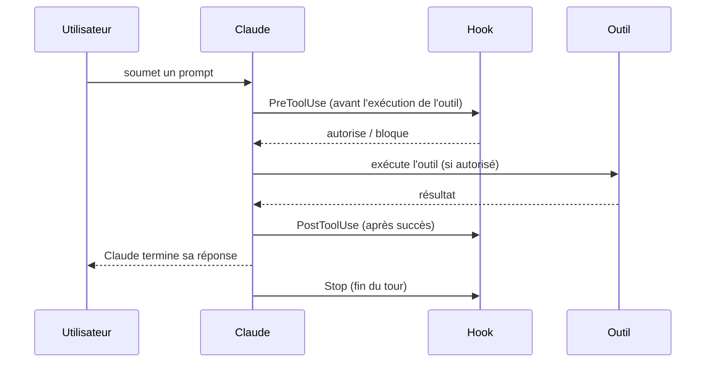

# Réagir automatiquement au cycle de vie de Claude Code

Les **hooks** exécutent une commande à des points précis du cycle de vie d'une session — c'est le mécanisme d'automatisation le plus « bas niveau » et le plus fiable, car il ne dépend pas d'une instruction que le modèle pourrait ignorer.

## Le cycle de vie et les événements clés



| Événement | Quand il se déclenche | Cas d'usage |
|---|---|---|
| `PreToolUse` | Avant l'exécution d'un outil. Peut **bloquer** l'appel. | Interdire une commande destructive (`rm -rf`), valider les paramètres avant exécution. |
| `PostToolUse` | Après le succès d'un outil. | Lancer un lint après une édition (`Edit`/`Write`). |
| `Stop` | Quand Claude termine sa réponse (fin du tour). | Lancer la suite de tests avant de considérer une tâche terminée. |

Les hooks se configurent dans `settings.json`, avec un **matcher** qui filtre sur le nom de l'outil (`Bash`, `Edit|Write`, une regex comme `mcp__.*`) — et optionnellement une condition `if` plus fine (ex. `Bash(rm *)` ne matche que les sous-commandes `rm`).

```json
{
  "hooks": {
    "PostToolUse": [
      {
        "matcher": "Edit|Write",
        "hooks": [
          { "type": "command", "command": "./scripts/lint-changed-file.sh" }
        ]
      }
    ]
  }
}
```

## Le coût d'un hook lent

Un hook **bloque le flux** : Claude Code attend sa fin avant de continuer. Un hook `PostToolUse` qui relance la **suite de tests complète du projet** à chaque édition de fichier ralentit chaque itération, même pour un changement d'une ligne dans un fichier sans rapport.

> 🎯 **Piège d'examen —** un scénario décrit un hook `PostToolUse` qui lance l'intégralité de la suite de tests après **chaque** édition, rendant la session « lente et pénible ». Deux corrections structurelles possibles, selon le contexte donné : (1) **cibler le hook** avec un `matcher`/`if` plus précis pour ne réagir qu'aux fichiers réellement concernés (ex. ne relancer que les tests du module modifié), ou (2) **déplacer la vérification lourde en CI** et garder dans le hook uniquement un contrôle rapide (lint, tests unitaires ciblés). La mauvaise réponse typique est de supprimer le hook entièrement (on perd la garantie) ou de le laisser tel quel en espérant que ça passe (ignore le vrai problème de coût).

## Permissions : allowlist et modes

Les permissions se configurent aussi dans `settings.json`, avec des règles `allow`/`deny` (souvent des motifs de commande Bash) :

```json
{
  "permissions": {
    "allow": ["Bash(npm run test *)", "Bash(npm run lint)"],
    "deny": ["Bash(curl *)", "Read(./.env)", "Read(./secrets/**)"]
  }
}
```

- **`allow`** — autorise sans demander confirmation à chaque fois (utile en CI/headless).
- **`deny`** — bloque, même si l'utilisateur tentait d'autoriser manuellement dans cette session.
- **Modes de permission** (`default`, `acceptEdits`, `plan`, `bypassPermissions`…) — contrôlent le niveau global de confirmation demandé pendant une session.

> 🎯 **Piège d'examen —** un scénario oppose une allowlist Bash trop large (`Bash(*)`) à une allowlist ciblée (`Bash(npm run test *)`, `Bash(npm run lint)`). La réponse structurelle attendue est toujours la **liste la plus restrictive qui couvre le besoin réel** — le principe de moindre privilège s'applique à la configuration de Claude Code exactement comme à IAM ou à toute politique d'accès.

## À retenir

- `PreToolUse` (peut bloquer), `PostToolUse` (après succès), `Stop` (fin de tour) : les trois événements les plus testés.
- Un hook lent bloque le flux : cibler le `matcher`/`if`, ou déplacer la vérification lourde en CI — ne pas le supprimer ni l'ignorer.
- Permissions `allow`/`deny` dans `settings.json` : appliquer le moindre privilège, comme pour toute politique d'accès.
