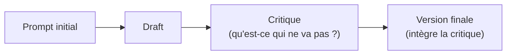

# Quand un aller-retour supplémentaire vaut le coût, et une technique obsolète à repérer

Deux sujets structurels qui reviennent régulièrement à l'examen : quand justifier un **pipeline multi-pass** (plusieurs appels au lieu d'un seul), et pourquoi le **préfill de la réponse assistant** — une technique historique — n'est plus la bonne réponse sur les modèles récents.

## Multi-pass : draft → critique → version finale

Un pipeline **multi-pass** enchaîne plusieurs appels au modèle sur la même tâche : un premier jet, une critique (par le même modèle ou un second appel dédié), puis une version finale intégrant la critique.

Ce pattern **coûte plus cher** (plusieurs appels, plus de latence) qu'un appel unique — il ne se justifie donc que lorsque :

- la tâche est **complexe et à fort enjeu** (contenu long, code critique, décision à fort impact) où la qualité prime sur le coût/la latence ;
- une **erreur de premier jet est probable et coûteuse** à laisser passer (contrairement à une extraction simple, où structured outputs suffit à garantir la forme).

> 🎯 **Piège d'examen —** un scénario propose un pipeline draft → critique → version finale pour une tâche simple et bien spécifiée (ex. extraire 3 champs d'un texte court). C'est un sur-coût injustifié : la variabilité qu'un multi-pass corrige (jugement, nuance, qualité rédactionnelle) n'existe pas sur une tâche d'extraction déterministe, où un appel simple avec un schéma structuré (leçon précédente) est suffisant et moins coûteux.

## Préfills assistants : supprimés sur les modèles récents

Historiquement, on pouvait **préremplir le début** de la réponse de l'assistant (ex. amorcer avec `{` pour forcer un JSON, ou avec un texte pour éviter un préambule) afin de contraindre la suite de la génération.

> **Changement structurel à connaître pour l'examen —** à partir de Claude 4.6 (et modèles ultérieurs), le préfill de la réponse assistant sur le **dernier tour** n'est **plus supporté** : une requête contenant un préfill assistant sur ces modèles renvoie une **erreur 400**. Les modèles antérieurs continuent à l'accepter, et un message assistant ajouté **ailleurs** dans la conversation (pas en dernière position) n'est pas concerné.

| Ancien usage du préfill | Remplacement structurel sur les modèles récents |
|---|---|
| Forcer un format de sortie (`{` pour amorcer du JSON) | `output_config.format` (structured outputs) — garantit le schéma sans préfill |
| Éliminer un préambule (« Voici le résumé demandé : ») | Instruction directe dans le **system prompt** (« réponds directement, sans préambule ») ; sinon structured outputs ou appel d'outil |
| Contourner un refus non désiré | Reformulation claire dans le message utilisateur — les modèles récents refusent plus justement |
| Reprendre une génération interrompue | Déplacer la continuation dans le message **utilisateur** (« ta réponse précédente s'est arrêtée à [texte], continue ») |

> 🎯 **Piège d'examen —** un scénario propose de préremplir la réponse assistant avec `{` pour garantir un JSON valide, sur un modèle récent (ex. `claude-opus-4-8`). Deux problèmes structurels : (1) le préfill sur le dernier tour est **rejeté (400)** sur ces modèles, et (2) même s'il fonctionnait, ce serait une technique **plus faible** que `output_config.format`, qui garantit tout le schéma — pas seulement le premier caractère.

## À retenir

- Multi-pass (draft → critique → finale) : justifié pour les tâches complexes à fort enjeu, pas pour l'extraction simple déjà couverte par un schéma structuré.
- Préfill de la réponse assistant sur le dernier tour : **supprimé** depuis Claude 4.6 (erreur 400) — remplacé par les structured outputs (format), une instruction système claire (préambule), ou une reformulation côté message utilisateur (refus, continuation).
