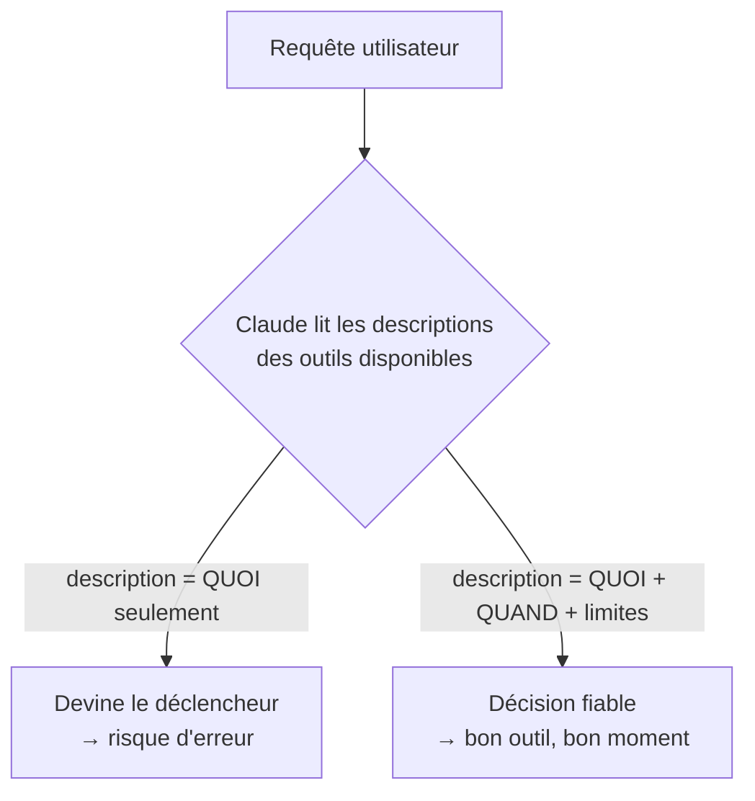

# Ce que Claude voit avant d'appeler un outil

Ce module pèse **18 % de l'examen** — le 4ᵉ domaine sur 5 par poids, juste derrière les deux domaines à 20 % (configuration Claude Code, prompt engineering) et devant la gestion du contexte (15 %). Avant de parler de `tool_choice`, d'appels parallèles ou de MCP, il faut maîtriser la brique de base : **comment décrire un outil pour que Claude sache l'utiliser correctement, au bon moment**.

## Les quatre champs d'une définition

```json
{
  "name": "refund_order",
  "description": "Issue a refund for a previously placed order. Use this tool when a customer explicitly requests a refund or cancellation AND the order status is 'delivered' or 'shipped'. Do not use it for orders still 'processing' — cancel_order should be used instead. Refunds over $500 require a human approval step handled automatically by this tool (it returns a pending_approval status in that case).",
  "input_schema": {
    "type": "object",
    "properties": {
      "order_id": {
        "type": "string",
        "description": "The order identifier, e.g. 'ORD-48213'"
      },
      "reason": {
        "type": "string",
        "enum": ["defective", "not_as_described", "changed_mind", "late_delivery"],
        "description": "The customer-stated reason for the refund"
      }
    },
    "required": ["order_id", "reason"]
  }
}
```

| Champ | Rôle |
|---|---|
| `name` | Identifiant court, verbe d'action (`refund_order`, pas `refund` ni `tool_3`). |
| `description` | Ce que fait l'outil, **quand l'appeler**, ses limites et cas particuliers. |
| `input_schema` | Un JSON Schema classique : `type`, `properties`, `enum` pour les valeurs fermées, `required` pour les champs obligatoires. |
| `strict` | Optionnel (`true`) — garantit que les paramètres renvoyés respectent exactement le schéma. |

## La description : LE point d'examen

Une erreur fréquente est de rédiger la `description` comme une **documentation d'API** (« retourne le statut d'une commande ») plutôt que comme une **instruction de déclenchement** (« utilise cet outil quand… »). Claude choisit l'outil à appeler en lisant sa description au même titre que son schéma : une description qui ne dit que **ce que fait** l'outil laisse Claude deviner **quand** l'utiliser — avec un risque de sur-déclenchement (appelé pour de mauvais cas) ou de sous-déclenchement (jamais appelé alors qu'il le faudrait).



> 🎯 **Piège d'examen —** une question qui présente un outil sous-utilisé ou mal utilisé par Claude, avec une `description` du type `"Gets the refund status for an order"`, attend une réponse **structurelle** : réécrire la description pour qu'elle précise **quand** l'appeler (déclencheurs, conditions, exclusions) — pas ajuster le `system prompt` avec des instructions générales sur « utilise mieux tes outils », et pas changer `tool_choice` (qui décide *si* un outil est appelé, pas *lequel*).

Comparons deux descriptions pour le même outil :

| Mauvaise description | Bonne description |
|---|---|
| `"Gets the refund status for an order"` | `"Retrieves the current refund status for an order. Use this tool whenever the customer asks about the progress of a refund they already requested. Do not use it to initiate a new refund — use refund_order for that. Returns one of: pending, approved, rejected, completed."` |

La bonne version répond à trois questions que Claude doit se poser à chaque tour : *que fait l'outil*, *quand dois-je l'appeler*, *qu'est-ce qui le distingue d'un outil voisin qui pourrait sembler correspondre*.

## `input_schema` : `enum` et `required`

- **`enum`** contraint une propriété à un ensemble fermé de valeurs (ex. les motifs de remboursement) : cela réduit la variabilité des entrées et évite à Claude d'inventer une valeur hors catalogue.
- **`required`** liste les propriétés obligatoires. Sans ce champ manquant précisé, Claude peut inférer une valeur plausible plutôt que de demander une clarification — comportement plus marqué sur les modèles plus légers, moins fiable pour des paramètres sensibles (montant, identifiant de compte).

## `strict: true` : garantir la conformité du schéma

Ajouter `"strict": true` sur une définition d'outil garantit que **les paramètres renvoyés par Claude respectent exactement le schéma déclaré** (types, `enum`, `required`) — élimine les paramètres manquants ou mal typés côté modèle. Combiné à `tool_choice: {"type": "any"}`, cela garantit à la fois qu'un outil **sera** appelé et que son entrée sera **valide**.

> 🎯 **Piège d'examen —** `strict: true` garantit la **conformité du schéma des paramètres**, pas la **justesse métier** du résultat. Un outil `strict` peut recevoir un `order_id` syntaxiquement valide mais qui ne correspond à aucune commande réelle — cette validation-là reste du ressort de l'exécution de l'outil (leçon suivante), pas du schéma.

## À retenir

- Une définition d'outil = `name` (verbe d'action) + `description` (quoi **et** quand) + `input_schema` (JSON Schema, `enum` pour les valeurs fermées, `required` pour les champs obligatoires) + `strict` optionnel.
- La description doit être **prescriptive** : dire explicitement quand appeler l'outil et ce qui le distingue des outils voisins — c'est le facteur le plus déterminant pour la qualité de la sélection d'outil.
- `strict: true` garantit la validité **structurelle** des paramètres, pas la validité métier du résultat.
