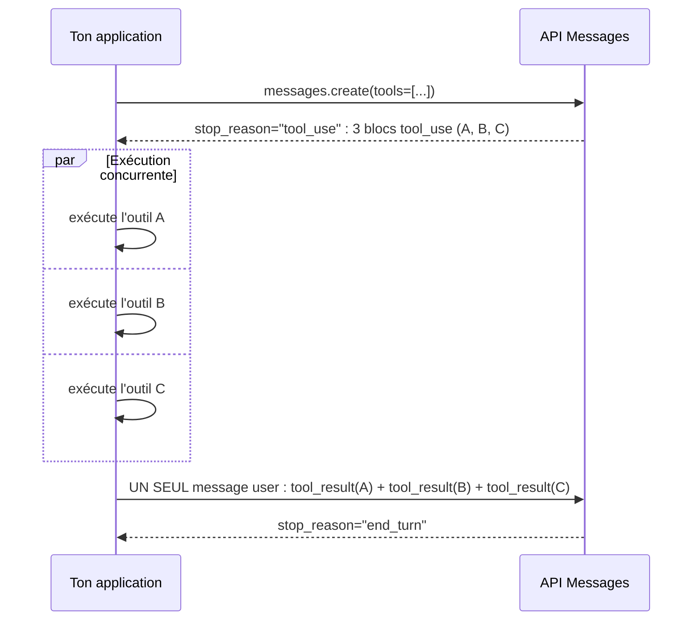

# Décider si, quel, et combien d'outils appeler

## Les quatre valeurs de `tool_choice`

| `tool_choice` | Comportement | Défaut |
|---|---|---|
| `{"type": "auto"}` | Claude décide librement d'appeler un outil ou de répondre en texte. | Oui, dès qu'un `tools` est fourni. |
| `{"type": "any"}` | Claude **doit** appeler un outil, mais choisit lequel. | — |
| `{"type": "tool", "name": "..."}` | Claude **doit** appeler cet outil précis. | — |
| `{"type": "none"}` | Claude ne peut appeler aucun outil. | Oui, si aucun `tools` n'est fourni. |

```python
import anthropic

client = anthropic.Anthropic()

response = client.messages.create(
    model="claude-opus-4-8",
    max_tokens=1024,
    tools=[refund_order_tool],
    tool_choice={"type": "tool", "name": "refund_order"},
    messages=[{"role": "user", "content": "I want a refund for order ORD-48213"}],
)
```

> 🎯 **Piège d'examen —** avec `any` ou `tool`, l'API **préremplit** le tour assistant pour forcer l'appel : Claude ne produira **aucun texte** avant le bloc `tool_use`, même si le prompt lui demande explicitement de commenter d'abord. Si l'on veut à la fois forcer un comportement outil-centré **et** garder un commentaire en langage naturel, la bonne pratique structurelle est de rester en `auto` et de guider via une instruction explicite dans le message utilisateur (« utilise l'outil refund_order pour répondre ») plutôt que de forcer `tool_choice`.

`disable_parallel_tool_use` est un champ **imbriqué dans `tool_choice`**, pas un paramètre de premier niveau :

```json
{ "tool_choice": { "type": "auto", "disable_parallel_tool_use": true } }
```

- Avec `auto` + `disable_parallel_tool_use: true` : Claude appelle **au plus un** outil par réponse (il peut toujours répondre en texte).
- Avec `any`/`tool` + `disable_parallel_tool_use: true` : Claude appelle **exactement un** outil.

## Appels parallèles : plusieurs `tool_use` dans une seule réponse

Par défaut, Claude peut demander **plusieurs outils indépendants dans la même réponse** — typiquement quand une tâche se décompose en sous-requêtes qui ne dépendent pas les unes des autres (ex. vérifier le stock **et** le statut de livraison de deux commandes différentes).



La règle de format est stricte : **tous les `tool_result` correspondant à un même tour de `tool_use` doivent revenir dans un seul message `user`**, et les blocs `tool_result` doivent être placés **avant** tout texte dans ce message.

```python
# Correct : one user message, all tool_results first
tool_results = [
    {"type": "tool_result", "tool_use_id": "toolu_A", "content": "In stock: 12 units"},
    {"type": "tool_result", "tool_use_id": "toolu_B", "content": "Order ORD-901 shipped"},
    {"type": "tool_result", "tool_use_id": "toolu_C", "content": "Order ORD-902 delivered"},
]
messages.append({"role": "user", "content": tool_results})
```

> 🎯 **Piège d'examen —** un scénario décrit un harnais qui exécute bien les outils **en concurrence**, mais renvoie **chaque `tool_result` dans un message `user` séparé** (un appel réseau par résultat, par simplicité d'implémentation). C'est le piège classique : **séparer les `tool_result` casse le parallélisme** — le format attendu est un **seul** message `user` regroupant tous les résultats du tour. La correction n'est pas de changer `tool_choice` ni le nombre d'outils déclarés, c'est de regrouper les résultats côté application avant de renvoyer la requête suivante.

## Pourquoi ça compte : latence et cohérence

Exécuter les outils **en concurrence** (via `asyncio.gather`, `Promise.all`, ou l'équivalent) réduit la latence totale à celle de l'outil le plus lent, plutôt qu'à la somme de tous les outils. Regrouper les résultats dans un seul message préserve en plus l'ordre attendu par le modèle pour associer chaque `tool_result` à son `tool_use_id` d'origine — l'association se fait par identifiant, pas par position, mais la structure « un tour de outils = un message de résultats » reste la convention que l'API attend.

## À retenir

- `tool_choice` : `auto` (défaut, libre), `any` (un outil, lequel il veut), `tool` (un outil précis), `none` (aucun). `any`/`tool` empêchent tout texte avant le `tool_use`.
- `disable_parallel_tool_use` vit **dans** l'objet `tool_choice`, pas au niveau racine de la requête.
- Plusieurs `tool_use` dans une réponse → exécuter **en concurrence**, renvoyer **tous les `tool_result` dans un seul message `user`**, résultats **avant** tout texte. Les séparer dégrade le parallélisme — piège d'examen classique.
