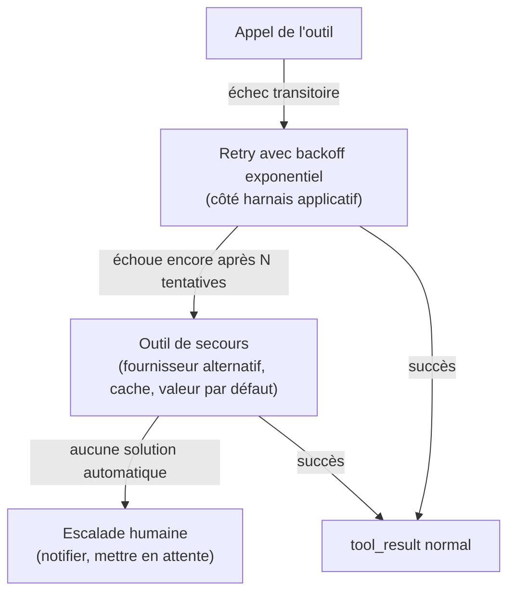

# Quand l'outil échoue — et qui l'exécute

## `is_error: true` : signaler un échec à Claude

Quand l'exécution d'un outil échoue côté application (timeout réseau, service tiers indisponible, permission refusée), on renvoie le `tool_result` avec `is_error: true` et un message **informatif** :

```json
{
  "type": "tool_result",
  "tool_use_id": "toolu_01A09q90qw90lq917835lq9",
  "content": "RateLimitError: payment provider rate limit exceeded. Retry after 60 seconds.",
  "is_error": true
}
```

Claude **s'adapte** à cette information : il peut proposer une alternative, informer l'utilisateur, ou retenter plus tard selon le contexte de la conversation — mais seulement si le message d'erreur est exploitable. Un message générique (`"failed"`) ne donne à Claude aucun levier ; un message qui précise **ce qui a échoué** et **quoi essayer ensuite** (« retente dans 60 s », « utilise l'identifiant au format ORD-XXXX ») lui permet de s'adapter intelligemment.

> 🎯 **Piège d'examen —** `is_error: true` ne s'applique **qu'aux outils client** (ceux que ton code exécute). Pour un **outil serveur** (`web_search`, `code_execution`) exécuté chez Anthropic, les erreurs sont gérées **de façon transparente par Claude lui-même** — tu n'as pas de `tool_result` à construire ni d'`is_error` à positionner pour ces outils-là.

## Le pattern d'examen : « l'outil échoue 5 % du temps »

Un scénario classique décrit un outil externe dont le taux d'échec transitoire est connu (réseau instable, service tiers avec incidents ponctuels). La réponse structurelle combine plusieurs niveaux, chacun avec un rôle distinct :



| Niveau | Rôle |
|---|---|
| **`is_error` + message informatif** | Donne à Claude le contexte pour décider de la suite **dans la conversation en cours**. |
| **Retry / backoff côté harnais** | Absorbe les échecs **transitoires** avant même que Claude ne les voie — ne pas déranger le modèle pour un timeout réseau ponctuel. |
| **Outil de secours** | Une alternative fonctionnelle (fournisseur B, cache, valeur par défaut dégradée) quand l'outil principal reste indisponible. |
| **Escalade humaine** | Dernier recours, pour les échecs persistants ou les décisions à fort enjeu qu'aucun des niveaux précédents ne peut résoudre seul. |

> 🎯 **Piège d'examen —** face à un outil qui échoue occasionnellement, une réponse qui se contente d'ajouter `"Please handle errors gracefully"` au system prompt est un **ajustement de prompt**, pas une solution structurelle : elle ne change rien au taux d'échec réel ni à la résilience du système. La bonne réponse combine retry/backoff **applicatif**, un `is_error` informatif pour les cas qui remontent jusqu'à Claude, et une échappatoire (secours ou humain) pour les échecs persistants.

## Outils serveur vs outils client

| | Outils **serveur** | Outils **client** |
|---|---|---|
| Exécution | Chez Anthropic (`web_search`, `code_execution`, `web_fetch`, `tool_search`) | Chez toi (`bash`, `text_editor`, tes outils personnalisés) |
| Résultat | Intégré directement dans la réponse, sans aller-retour | Nécessite un `tool_result` que tu construis et renvoies |
| Gestion des erreurs | Transparente, gérée par Claude | À ta charge (`is_error`) |
| Coût additionnel | Souvent facturé à l'usage (ex. par recherche) | Coût standard de tokens uniquement |

Les outils client à schéma **fourni par Anthropic** (`bash`, `text_editor`, `computer_use`) sont classiquement exécutés **par toi** — Anthropic ne fait qu'entraîner Claude à les utiliser correctement ; l'exécution réelle (lancer une commande shell, modifier un fichier) est de ta responsabilité, avec les précautions de sécurité que cela implique. Nuance récente : computer use existe aussi en variante **hébergée côté Anthropic** (environnement géré) — mais le modèle canonique reste l'exécution auto-hébergée dans un environnement sandboxé que tu fournis.

## Précautions de sécurité pour les outils client à fort pouvoir

Un outil `bash` ou `text_editor` donne à Claude un accès direct au système — les précautions structurelles à connaître :

- **Allowlist de commandes/chemins** — restreindre l'outil `bash` à un ensemble de commandes autorisées plutôt que d'exposer un shell sans restriction ; pour un éditeur de fichiers, valider que le chemin cible reste dans un répertoire autorisé.
- **Sandbox / isolation** — exécuter dans un conteneur ou une VM éphémère, sans accès au réseau de production ni aux identifiants sensibles de l'hôte.
- **Validation de chemin (path traversal)** — rejeter tout chemin contenant `../` ou résolu en dehors du répertoire de travail autorisé, avant d'exécuter l'opération. C'est le même réflexe que l'outil `memory` d'Anthropic applique lui-même pour restreindre ses opérations au seul répertoire `/memories`.
- **Confirmation humaine pour les actions destructives** — suppression de données, déploiement en production, transaction financière : un gate humain avant exécution, quel que soit le niveau de confiance affiché par le modèle.

## À retenir

- `is_error: true` + message **informatif** (quoi + quoi essayer ensuite) : pour les outils **client** uniquement — les outils serveur gèrent leurs erreurs de façon transparente.
- « L'outil échoue 5 % du temps » attend une réponse à plusieurs niveaux : retry/backoff applicatif → outil de secours → escalade humaine. Un ajustement de prompt seul n'est pas une solution structurelle.
- Outils client = exécution et sécurité **de ton ressort** (allowlist, sandbox, validation de chemin, gate humain sur l'irréversible) ; outils serveur = exécutés et gérés par Anthropic.
