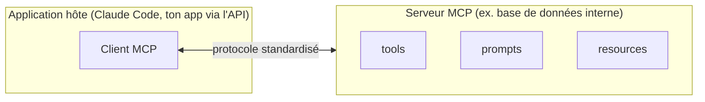

# Model Context Protocol

## Le problème que MCP résout

Sans standard commun, connecter N applications à M outils/sources de données externes demande N×M intégrations sur mesure. **MCP (Model Context Protocol)** est un protocole ouvert et standardisé : un **serveur MCP** expose des **tools** (fonctions appelables), des **prompts** (gabarits réutilisables) et des **resources** (données consultables) de façon uniforme ; n'importe quel **client MCP** (Claude Code, une app qui utilise l'API) peut s'y connecter sans code d'intégration spécifique à ce serveur.



## Les transports

La spécification MCP elle-même ne définit que **deux** transports standards : **stdio** et **Streamable HTTP**. Le tableau ci-dessous inclut aussi SSE (ancien transport, déprécié) et WebSocket, une **extension propre à Claude Code** — à ne pas confondre avec la spec MCP elle-même :

| Transport | Usage | Caractéristiques |
|---|---|---|
| **stdio** *(spec MCP)* | Serveur **local** (process sur la même machine) | Accès direct au système de fichiers/outils locaux ; pas de réseau ; pas de reconnexion automatique si le process meurt. |
| **Streamable HTTP** *(spec MCP)* | Serveur **distant** (service cloud) | Transport standard recommandé pour les services distants ; authentification par token ; reconnexion automatique avec backoff en cas de coupure. |
| **SSE** *(spec MCP, ancien)* | Serveur distant (ancien) | **Déprécié** — à remplacer par Streamable HTTP quand le serveur le propose. |
| **WebSocket** *(extension Claude Code, hors spec MCP)* | Serveur distant à push d'événements, ajouté via `claude mcp add --transport ws` (`"type": "ws"` dans `.mcp.json`) | Connexion bidirectionnelle persistante ; utile quand le serveur doit notifier sans attendre une requête ; ce n'est pas un transport de la spécification MCP, seulement un ajout spécifique au client Claude Code. |

> 🎯 **Piège d'examen —** un outil qui a besoin d'un accès **direct au système de fichiers local** ou d'exécuter des commandes sur la machine de l'utilisateur est un candidat naturel pour un serveur **stdio** ; un service partagé par toute une équipe, hébergé dans le cloud, est un candidat pour un serveur **HTTP**. Confondre les deux (ex. proposer HTTP pour un besoin d'accès filesystem local) est une erreur de choix de transport fréquente à l'examen.

## Consommer un serveur MCP

**Dans Claude Code**, la commande `claude mcp add` (ou un fichier `.mcp.json` versionné pour le partager avec l'équipe) déclare la connexion — détail des portées et de la gestion des secrets dans le module Claude Code.

**Via l'API Messages**, le connecteur MCP permet de déclarer un serveur distant directement dans la requête, sans écrire de client MCP séparé :

```python
import anthropic

client = anthropic.Anthropic()

response = client.beta.messages.create(
    model="claude-opus-4-8",
    max_tokens=1024,
    mcp_servers=[
        {
            "type": "url",
            "url": "https://mcp.example-crm.com/mcp",
            "name": "example-crm",
            "authorization_token": "YOUR_TOKEN",
        }
    ],
    tools=[{"type": "mcp_toolset", "mcp_server_name": "example-crm"}],
    messages=[{"role": "user", "content": "List open tickets for customer ACME"}],
    betas=["mcp-client-2025-11-20"],
)
```

Deux champs distincts : **`mcp_servers`** décrit la connexion (URL, authentification), **`tools`** avec `{"type": "mcp_toolset", "mcp_server_name": "..."}` expose les outils de ce serveur à Claude comme n'importe quel autre outil.

## Concevoir un serveur MCP

Construire son propre serveur MCP (plutôt que d'en consommer un) impose les mêmes disciplines qu'une bonne API :

- **Granularité des outils** — ni un outil unique trop générique (`execute_sql`, qui expose toute la surface d'attaque d'une base de données et oblige Claude à deviner une syntaxe), ni un éclatement excessif en dizaines de micro-outils redondants. Viser un outil par **action métier claire** (`get_customer_orders`, `create_support_ticket`) avec une description prescriptive (leçon 1).
- **Pagination des gros résultats** — un outil qui retourne des milliers de lignes d'un coup consomme inutilement la fenêtre de contexte (module suivant) et dégrade la qualité de la réponse. Retourner une page + un curseur de continuation, comme le ferait une bonne API REST, plutôt qu'un déversement complet.
- **Authentification** — un token par serveur, avec le principe du **moindre privilège** (un scope de lecture seule si l'usage ne nécessite pas d'écriture) ; ne jamais coder un secret en dur dans la configuration du serveur.

## Tool search : passer à l'échelle sur de grandes bibliothèques d'outils

Au-delà de 30 à 50 outils disponibles simultanément, la capacité de Claude à choisir le bon outil se dégrade — et charger d'un coup les définitions de centaines d'outils MCP peut à elle seule consommer des dizaines de milliers de tokens avant même de commencer la tâche. Le **tool search** répond à ce problème : on marque les outils peu utilisés avec `defer_loading: true`, et Claude ne charge leur schéma complet **qu'au moment où il les découvre par une recherche**, plutôt que de tout charger par avance.

```json
{
  "tools": [
    { "type": "tool_search_tool_regex_20251119", "name": "tool_search_tool_regex" },
    { "name": "get_customer_orders", "description": "...", "defer_loading": true },
    { "name": "create_support_ticket", "description": "...", "defer_loading": true }
  ]
}
```

Deux variantes existent pour l'outil de recherche : `tool_search_tool_regex_20251119` (Claude construit des motifs `regex` — l'exemple ci-dessus) et `tool_search_tool_bm25_20251119` (recherche par pertinence textuelle façon moteur de recherche). Aucune autre variante n'existe : un type d'outil qui ne correspond à ni l'une ni l'autre de ces deux valeurs n'est pas un type `tool_search` valide.

Point important pour l'examen : le préfixe mis en cache (module suivant) reste **intact**, car les outils différés sont exclus du système de prompt tant qu'ils ne sont pas découverts — `defer_loading` réduit le contexte chargé **sans casser le prompt caching**. Pour un serveur MCP entier, on active le différé une seule fois sur l'entrée `mcp_toolset` plutôt que outil par outil.

## À retenir

- MCP standardise l'exposition de **tools/prompts/resources** par un serveur, consommable par n'importe quel client MCP sans intégration sur mesure.
- Transports de la **spec MCP** : **stdio** pour du local (accès système direct), **Streamable HTTP** pour du distant (recommandé), **SSE** déprécié. **WebSocket** n'est pas dans la spec MCP — c'est une **extension propre à Claude Code**, à réserver au push d'événements dans ce contexte précis.
- Consommer via l'API : `mcp_servers` (connexion) + `tools: [{"type": "mcp_toolset", ...}]` (exposition des outils).
- Concevoir un serveur : granularité par action métier, pagination des gros résultats, auth à moindre privilège.
- Tool search (`defer_loading: true`) : charge les schémas à la demande, préserve le cache — indispensable au-delà de 30-50 outils. Deux variantes seulement : `tool_search_tool_regex_20251119` et `tool_search_tool_bm25_20251119`.
