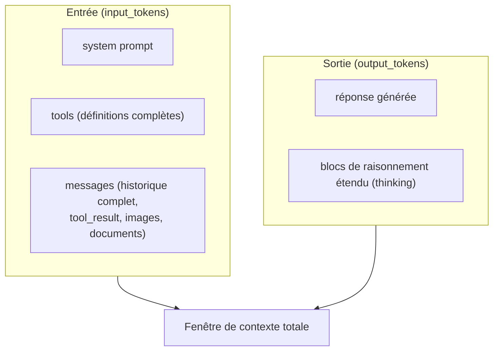

# Ce qui compte dans la fenêtre de contexte

Ce module pèse **15 % de l'examen**. Il porte sur la gestion du contexte comme ressource : ce qui l'occupe, comment le mesurer, comment le mettre en cache, et comment le faire durer sur des sessions longues.

## Ce qui occupe la fenêtre

La fenêtre de contexte contient **tout** ce que le modèle voit pour produire une réponse, entrée **et** sortie :



Selon le modèle, la fenêtre disponible va de **200K à 1M tokens**. Un point souvent mal compris : **plus de contexte n'est pas automatiquement mieux**. Au-delà d'un certain volume, la précision et le rappel se dégradent — un phénomène connu sous le nom de **context rot**. Curer ce qui entre dans le contexte (ne garder que ce qui est pertinent à la tâche) est aussi important que la taille disponible.

> 🎯 **Piège d'examen —** un scénario qui propose de « charger toute la documentation produit dans le system prompt, au cas où » pour améliorer la fiabilité d'un agent attend une réponse **négative** : au-delà de la pertinence immédiate, ce volume ajoute du bruit qui peut dégrader la qualité de la réponse (context rot), sans compter le coût de tokens à chaque requête. La bonne pratique est de ne charger que le contexte **pertinent à la tâche**, quitte à le récupérer dynamiquement (RAG, outil de recherche — leçon 3).

## Mesurer : `count_tokens`, jamais `tiktoken`

Pour estimer le nombre de tokens d'une requête **avant** de l'envoyer (dimensionner un prompt, vérifier qu'on reste dans la fenêtre disponible), l'API expose un endpoint dédié :

```python
import anthropic

client = anthropic.Anthropic()

response = client.messages.count_tokens(
    model="claude-opus-4-8",
    system="You are a support assistant for Acme Corp.",
    tools=[refund_order_tool],
    messages=[{"role": "user", "content": "How do I request a refund?"}],
)
print(response.input_tokens)
```

Ce comptage est **gratuit** (soumis aux limites de requêtes par minute du palier d'usage, pas à une facturation), et retourne une **estimation** — le nombre réel de tokens consommés à la création du message peut différer légèrement.

> 🎯 **Piège d'examen —** utiliser une bibliothèque de tokenisation générique (type `tiktoken`, conçue pour une autre famille de modèles) pour estimer la consommation de tokens d'un prompt Claude donne un résultat **incorrect** : chaque famille de modèles a son propre tokenizer, et les comptages ne sont pas interchangeables d'une famille à l'autre. La seule mesure fiable pour un modèle Claude est l'endpoint `count_tokens` de l'API elle-même.

## À retenir

- La fenêtre de contexte compte le system prompt, les définitions d'outils, tout l'historique de messages (y compris `tool_result`, images, documents) **et** la sortie générée (y compris le raisonnement étendu).
- Plus de contexte n'est pas automatiquement mieux : au-delà de la pertinence, le volume dégrade la précision (context rot) — curer plutôt que tout charger « au cas où ».
- Mesurer avec `count_tokens` (gratuit, estimation) — jamais avec une bibliothèque de tokenisation générique type `tiktoken`, qui ne correspond pas au tokenizer de Claude.
