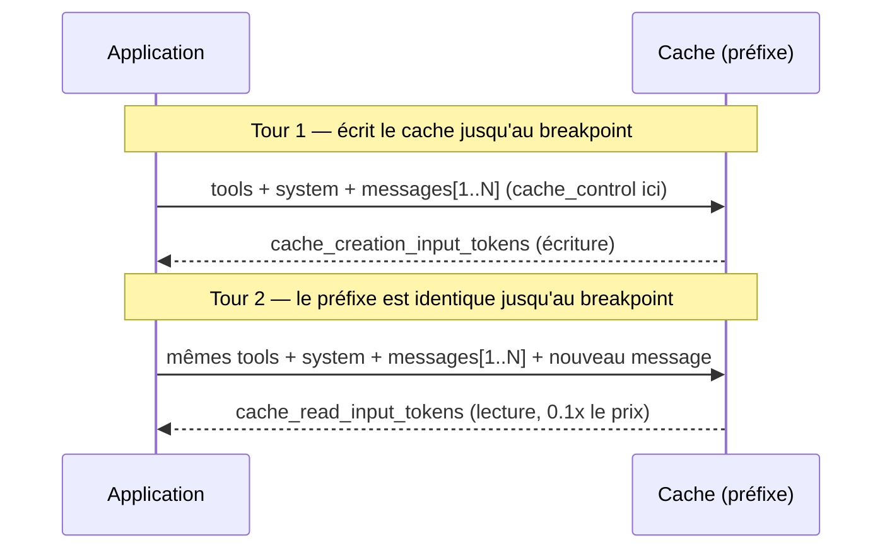

# Le sujet le plus dense de l'examen

Le prompt caching est **LE** sujet où le domaine « context management » est le plus testé. L'idée centrale à retenir avant tout le reste : **le cache est un cache de PRÉFIXE**. Tout octet modifié à un endroit donné invalide le cache pour ce point **et tout ce qui suit**.

## L'ordre qui compte : `tools` → `system` → `messages`

Anthropic met en cache le prompt selon une hiérarchie fixe : **`tools`, puis `system`, puis `messages`**, dans cet ordre. Un changement à un niveau invalide ce niveau **et tous les niveaux suivants** — mais pas les niveaux précédents.



## `cache_control` : où poser le breakpoint

Un breakpoint se pose avec `{"type": "ephemeral"}` sur le dernier bloc que l'on veut couvrir par le cache :

```json
{
  "model": "claude-opus-4-8",
  "max_tokens": 1024,
  "system": [
    {
      "type": "text",
      "text": "You are a support assistant for Acme Corp. [... long stable policy text ...]",
      "cache_control": { "type": "ephemeral" }
    }
  ],
  "tools": [ /* ... stable tool definitions ... */ ],
  "messages": [
    { "role": "user", "content": "How do I request a refund for order ORD-48213?" }
  ]
}
```

Règle centrale : **le breakpoint doit être posé sur le dernier bloc qui reste identique** d'une requête à l'autre. Tout ce qui vient **après** (le message utilisateur du tour courant, une donnée volatile) reste hors cache — c'est normal et attendu, seul le **préfixe stable** doit être couvert.

- **Maximum 4 breakpoints explicites** par requête.
- Il existe aussi un **cache automatique** : un seul `cache_control` au niveau racine de la requête, qui déplace lui-même le breakpoint sur le dernier bloc « cachable » à mesure que la conversation grandit — pratique pour les conversations multi-tours, mais il consomme un des 4 emplacements de breakpoint disponibles.

## Les invalidateurs silencieux — LE piège d'examen

Le cache **ne renvoie jamais d'erreur** en cas d'incohérence : il se contente de **ne pas matcher**, et la requête est traitée au tarif plein sans avertissement. C'est ce silence qui rend ces pièges dangereux en production :

| Invalidateur silencieux | Pourquoi ça casse le cache |
|---|---|
| **Un horodatage vivant dans le system prompt** (`"Current time: 14:32:07"`) | Change à chaque requête (ou chaque minute) → le préfixe n'est jamais identique deux fois → cache jamais réutilisé, alors que tout le reste du system prompt est stable. |
| **Outils réordonnés** entre deux requêtes | Le cache suit la hiérarchie `tools → system → messages` : un simple changement d'ordre des outils change le hash du préfixe dès ce niveau, invalidant `system` et `messages` en cascade. |
| **JSON non trié** (clés sérialisées dans un ordre différent d'une requête à l'autre) | Deux objets JSON logiquement identiques mais sérialisés dans un ordre de clés différent produisent des octets différents → hash différent → cache manqué. |
| **Changement de `tool_choice`** | Invalide les blocs de **messages** mis en cache (les définitions d'outils et le system prompt restent valables, mais le contenu des messages doit être retraité). |
| **Préfixe sous le seuil minimal cachable** | Chaque modèle a une longueur minimale en dessous de laquelle rien n'est mis en cache, **sans erreur** : 512 tokens (Fable 5), 1 024 (Opus 4.8, Sonnet 5, Sonnet 4.6), 2 048 (Opus 4.7), 4 096 (Opus 4.6, Haiku 4.5). Un `cache_control` posé sur un prompt trop court est simplement ignoré — symptôme : `cache_creation_input_tokens` **et** `cache_read_input_tokens` à 0. |

> 🎯 **Piège d'examen —** un scénario décrit un system prompt qui inclut la date et l'heure courantes pour donner à Claude un repère temporel, et une équipe qui s'étonne de ne jamais observer de `cache_read_input_tokens` dans les métriques d'usage malgré un `cache_control` bien positionné. La cause structurelle : l'horodatage vivant **dans le préfixe caché** change à chaque requête, invalidant le cache silencieusement à chaque appel. La correction est de **sortir l'horodatage du bloc mis en cache** (le placer après le breakpoint, dans le contenu volatile du tour courant) plutôt que de renoncer au cache ou d'ajuster la durée de vie du cache.

## Vérifier que le cache fonctionne

Le champ `usage` de chaque réponse donne trois compteurs à surveiller :

```json
{
  "usage": {
    "input_tokens": 50,
    "cache_creation_input_tokens": 0,
    "cache_read_input_tokens": 100000
  }
}
```

- `cache_read_input_tokens` : tokens du préfixe **lus depuis le cache** (économie).
- `cache_creation_input_tokens` : tokens du préfixe **écrits** dans le cache à cette requête (coût d'écriture, une seule fois).
- `input_tokens` : tokens **après** le dernier breakpoint, jamais éligibles au cache.

Si `cache_creation_input_tokens` et `cache_read_input_tokens` sont tous les deux à `0` sur une requête censée bénéficier du cache : le cache n'a pas matché — c'est le signal à chercher en premier en cas de doute.

## Économie : écriture 1,25×, lecture 0,1×

| Type de token | Coût relatif au prix d'entrée standard |
|---|---|
| Écriture cache (5 min, par défaut) | **1,25×** |
| Lecture cache | **0,1×** |
| (Écriture cache 1h, option additionnelle) | Plus chère que 5 min, pour des cas moins fréquents qu'une fois toutes les 5 minutes |

L'écriture coûte donc plus cher qu'une requête normale — mais dès la **deuxième** requête qui réutilise ce préfixe, la lecture à 0,1× rend l'opération très rentable dès que le préfixe est réutilisé plusieurs fois.

## Quoi mettre en cache, quoi laisser après le breakpoint

| Dans le préfixe caché | Après le dernier breakpoint (volatile) |
|---|---|
| System prompt figé (règles métier stables) | Le message utilisateur du tour courant |
| Définitions d'outils (stables) | Un horodatage vivant, un identifiant de session, une donnée qui change à chaque appel |
| Contexte de référence stable (documentation, exemples few-shot fixes) | Le résultat d'un outil qui vient d'être exécuté ce tour-ci |

## À retenir

- Le cache est un cache de **préfixe** : ordre `tools → system → messages`, `cache_control: {type: ephemeral}` posé sur le **dernier bloc stable**, maximum **4 breakpoints** explicites.
- Invalidateurs silencieux — **aucune erreur, juste un cache manqué** : horodatage vivant dans le préfixe, outils réordonnés, JSON non trié, changement de `tool_choice`.
- Vérifier via `usage.cache_read_input_tokens` / `cache_creation_input_tokens` ; économie : écriture **1,25×**, lecture **0,1×**.
