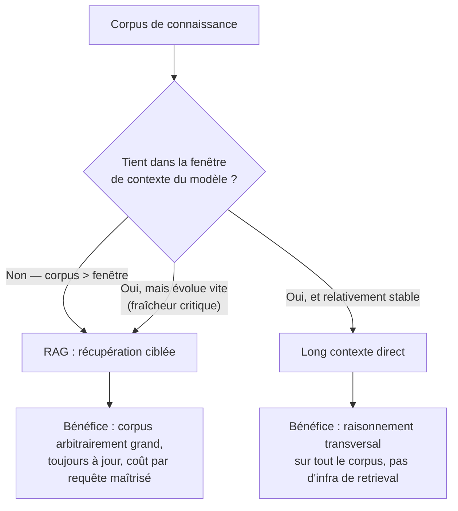
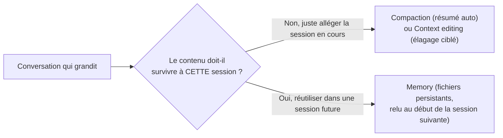

# Deux décisions structurelles de gestion du contexte

## RAG ou long contexte direct ?

Deux stratégies pour donner à Claude accès à un corpus de connaissance : le charger en entier dans le contexte, ou n'en récupérer que les fragments pertinents à la demande (**RAG**, Retrieval-Augmented Generation).

| | RAG | Long contexte direct |
|---|---|---|
| Taille du corpus | Dépasse la fenêtre de contexte (voire largement) | Tient confortablement dans la fenêtre |
| Fraîcheur | Données qui changent souvent — la récupération se fait à la demande, toujours à jour | Corpus relativement stable entre deux requêtes |
| Coût par requête | Ne charge que les fragments pertinents | Charge (ou met en cache) l'intégralité du corpus à chaque fois |
| Raisonnement transversal | Limité aux fragments récupérés | Meilleur — le modèle voit tout le corpus simultanément |
| Complexité d'infrastructure | Nécessite une pipeline de récupération (index, recherche) | Aucune infrastructure supplémentaire |

> 🎯 **Piège d'examen —** un scénario décrit un corpus documentaire de quelques centaines de pages, stable, qui change une fois par trimestre, et demande la meilleure architecture pour y répondre avec un raisonnement qui croise plusieurs documents à la fois. La réponse attendue est le **long contexte direct** (éventuellement avec prompt caching pour maîtriser le coût), pas du RAG — RAG est justifié par la **taille** du corpus ou sa **fraîcheur**, pas par principe. Inversement, un corpus qui grossit en continu (base de tickets support, catalogue produit mis à jour en temps réel) justifie le RAG même s'il tenait encore dans le contexte hier.

## Gérer une session longue : trois stratégies complémentables

Une conversation ou une tâche agentique qui s'étend sur de nombreux tours accumule du contenu — en particulier des `tool_result` volumineux (résultats de recherche, contenus de fichiers). Trois stratégies, **qui se combinent**, gèrent cette croissance :

| Stratégie | Ce qu'elle fait | Portée |
|---|---|---|
| **Compaction** | Résume automatiquement, côté serveur, les parties les plus anciennes de la conversation une fois un seuil de tokens atteint. | Une **seule** conversation, gestion automatique. |
| **Context editing** | Élague chirurgicalement des éléments précis : les vieux `tool_result` devenus inutiles (stratégie « tool result clearing »), ou les blocs de raisonnement étendu (« thinking block clearing »). | Une **seule** conversation, contrôle fin. |
| **Memory** | Un outil (client-side) qui écrit et relit des fichiers dans un répertoire dédié, pour faire persister des faits **entre** les conversations. | **Plusieurs** conversations / sessions successives. |

> 🎯 **Piège d'examen —** confondre la **portée** de ces trois mécanismes est l'erreur la plus fréquente. Compaction et context editing gèrent la croissance du contexte **à l'intérieur d'une même conversation** — ils ne font rien persister au-delà. Memory est le seul des trois pensé pour qu'une information **survive au-delà de la session en cours** (un agent qui reprend un projet le lendemain, par exemple). Un scénario qui demande « comment faire en sorte qu'un agent se souvienne d'une préférence client d'une session à l'autre » n'est **pas** résolu par de la compaction ou du context editing seuls — il faut memory (éventuellement en complément des deux autres pour la gestion intra-session).

Ces trois approches ne s'excluent pas : un agent qui tourne plusieurs heures dans une même session peut combiner context editing (élaguer les vieux résultats d'outils au fil de l'eau) et compaction (résumer le tout une fois un seuil dépassé) — puis écrire dans sa mémoire les faits qui devront survivre à la fin de la session.

## À retenir

- RAG quand le corpus **dépasse** la fenêtre de contexte ou évolue **trop vite** pour être re-chargé en entier à chaque fois ; long contexte direct quand le corpus est stable et tient confortablement, avec le bénéfice d'un raisonnement transversal sur l'ensemble.
- Sessions longues : **compaction** (résumé auto, seuil de tokens), **context editing** (élagage ciblé des vieux `tool_result`/`thinking`), **memory** (persistance **entre** sessions, via des fichiers) — les trois se combinent, chacun avec une portée différente.
- L'erreur classique : traiter compaction/context editing comme des solutions de persistance inter-session — ce n'est le rôle que de memory.
