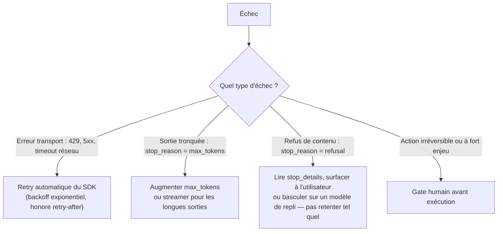

# Le triangle coût / qualité / fiabilité

## Sélection de modèle

| Modèle | Profil | Cas d'usage typiques |
|---|---|---|
| **Opus** | Le plus capable, pensé pour le complexe et l'agentique long | Refactoring de grande ampleur, raisonnement multi-étapes, tâches à fort enjeu |
| **Sonnet** | Équilibre volume/qualité | La majorité des charges de production : génération de code, analyse, usage d'outils agentique |
| **Haiku** | Rapide, économique | Tâches simples et à fort volume, sous-agents, classification, latence critique |

Le choix du modèle n'est pas le seul levier : le paramètre **`effort`** ajuste, **au sein d'un même modèle**, l'intensité de raisonnement déployée :

| `effort` | Comportement |
|---|---|
| `low` | Le plus économique, pour des tâches simples et bien bornées (ex. sous-agents à faible enjeu). |
| `medium` | Compromis coût/qualité pour la charge agentique courante. |
| `high` *(défaut)* | Raisonnement complet, pour les tâches complexes où la qualité prime. |
| `xhigh` | Capacité étendue pour les tâches agentiques **longue durée** (30+ minutes, budgets de tokens en millions) — entre `high` et `max`. Disponible sur Opus 4.7+ (Opus 4.7, Opus 4.8), Sonnet 5 et Fable 5. |
| `max` | Capacité maximale, sans contrainte de dépense de tokens — réservé aux problèmes les plus exigeants. |

> 🎯 **Piège d'examen —** face à un besoin de réduire les coûts sur une charge qui reste globalement satisfaisante en qualité, ajuster **`effort`** à la baisse (ex. `high` → `medium`) est souvent un meilleur premier levier que de **changer de modèle** : cela reste sur le même modèle, avec un comportement plus conservateur en dépense de tokens, avant d'envisager une rétrogradation de modèle plus radicale.

## Optimiser les coûts

- **Prompt caching** (leçon précédente) — le levier le plus direct pour un system prompt et des définitions d'outils réutilisés à chaque requête.
- **Batches API** — pour du traitement **asynchrone**, sans besoin de réponse immédiate (ex. classification en masse d'un historique de tickets) : **-50 %** sur le tarif standard, avec un traitement généralement complété sous une heure (jusqu'à 24h).
- **Router par complexité de tâche** — un routeur qui envoie les sous-tâches simples vers un modèle économique (`effort` bas, modèle léger) et réserve le modèle le plus capable aux étapes qui le justifient réellement, plutôt qu'un seul modèle unique pour toute la charge.

## Fiabilité : trois couches distinctes

L'examen aime tester la confusion entre trois mécanismes de résilience, à des niveaux différents :

| Couche | Ce qu'elle couvre | Ce qu'elle ne couvre pas |
|---|---|---|
| **Retry automatique du SDK** | Erreurs **transport** transitoires (429, 5xx, coupure réseau), avec backoff exponentiel — activé par défaut, configurable. | Les échecs **métier** d'un outil (ceux-là relèvent d'`is_error` + retry applicatif, module précédent). |
| **Streaming** | Obligatoire pour les sorties longues, pour éviter un **timeout HTTP** avant la fin de la génération. | Ne change rien à la qualité ou au contenu de la réponse. |
| **Gestion des `stop_reason`** | `max_tokens` (troncature — augmenter la limite ou streamer/reprendre) ; `refusal` (décliné — remonter l'information, éventuellement re-router vers un modèle de repli, **jamais** retenter le prompt à l'identique en espérant un résultat différent). | Ne remplace pas un gate humain sur une action destructive. |
| **Escalade humaine** | Actions irréversibles ou à fort coût d'erreur (suppression de données, transaction financière, déploiement production) — confirmation avant exécution, quel que soit le niveau de confiance affiché. | Ne se substitue pas à la gestion technique des erreurs transport ou de troncature. |

> 🎯 **Piège d'examen —** un scénario qui décrit une réponse tronquée (`stop_reason: "max_tokens"`) et propose de **retenter la même requête à l'identique en espérant une réponse plus courte** confond troncature et échec transitoire : la correction structurelle est d'**augmenter `max_tokens`** ou de **streamer** pour les sorties longues, pas de retenter aveuglément. Symétriquement, un `refusal` ne se résout pas en insistant avec le même prompt : il faut lire `stop_details` et, le cas échéant, basculer sur un modèle de repli.

## À retenir

- Modèle : Opus (complexe/agentique) — Sonnet (équilibre) — Haiku (simple/rapide/économique) ; `effort` (`low` → `medium` → `high` → `xhigh` → `max`) ajuste l'intensité **au sein** d'un même modèle, souvent un levier plus fin qu'un changement de modèle.
- Coûts : prompt caching, Batches API (**-50 %**, asynchrone), routage par complexité de tâche.
- Fiabilité en trois couches distinctes : retry SDK (erreurs transport), streaming (éviter les timeouts sur les longues sorties), gestion des `stop_reason` (`max_tokens` ≠ `refusal`, deux traitements différents) — et un gate humain systématique sur l'irréversible.
