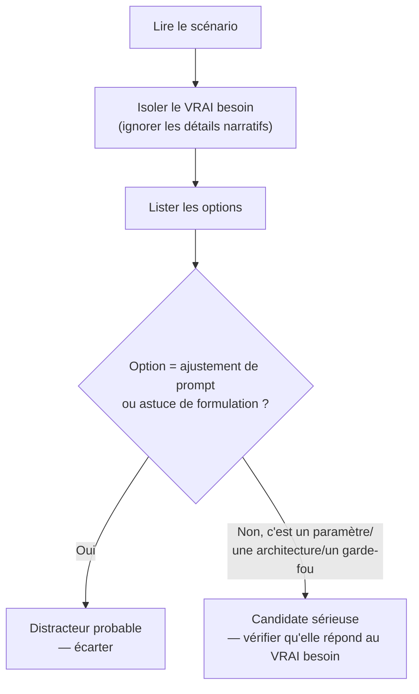

# Décoder l'énoncé avant de choisir une réponse

## La méthode en deux étapes

Les questions de ces certifications sont des **scénarios** — plusieurs phrases de contexte métier avant les quatre options. Deux réflexes structurent la lecture :

1. **Identifier le VRAI besoin.** Une question scénario contient souvent des détails narratifs qui ne changent rien à la décision technique (nom de l'entreprise, contexte commercial, détails anecdotiques). Isoler la contrainte réelle : quel est le problème technique posé, précisément ?
2. **Chercher la réponse STRUCTURELLE plutôt que l'astuce de prompt.** Une option qui propose de « reformuler une instruction dans le system prompt » ou d'« ajouter une phrase de prudence » est presque toujours un distracteur quand la question porte sur un problème d'architecture ou de paramètre d'API. La bonne réponse est un choix **structurel** : un paramètre (`tool_choice`, `cache_control`, `max_tokens`, `strict`), une architecture (RAG vs long contexte, agent vs workflow), ou un garde-fou (retry, escalade humaine).

## Exemple 1 : le double débit

> *« Un agent d'e-commerce appelle occasionnellement deux fois le même outil `charge_payment` pour une seule commande, provoquant un double débit chez le client. L'équipe envisage d'ajouter au system prompt : "Ne débite jamais deux fois la même commande." »*

- **Détails narratifs à ignorer** : le secteur (e-commerce), le nom de l'outil.
- **Vrai besoin** : empêcher un effet de bord dupliqué, indépendamment de ce que le modèle « décide » de faire.
- **Pourquoi l'option prompt est un piège** : une instruction en langage naturel n'est pas une **garantie** — elle réduit la probabilité, sans l'éliminer, et rien ne borne le comportement si le modèle réinterprète la situation différemment un jour.
- **Réponse structurelle attendue** : une **clé d'idempotence** dans le schéma d'entrée de l'outil (ex. un `idempotency_key` généré une fois par commande), vérifiée côté serveur avant d'exécuter le débit — un paramètre d'API/une contrainte d'implémentation, pas une phrase de prompt.

## Exemple 2 : la réponse obsolète

> *« Un chatbot de support répond parfois avec une information de tarification périmée, alors que la documentation source a été mise à jour la veille. L'équipe envisage d'ajouter au system prompt : "Vérifie toujours que tes informations sont à jour avant de répondre." »*

- **Détails narratifs à ignorer** : le support client, le délai précis (« la veille »).
- **Vrai besoin** : garantir que la donnée utilisée provient bien de la version la plus récente de la documentation.
- **Pourquoi l'option prompt est un piège** : demander au modèle de « vérifier que c'est à jour » ne lui donne aucun moyen concret de le faire — il n'a accès qu'à ce qui est dans son contexte au moment de répondre.
- **Réponse structurelle attendue** : une architecture de **récupération** (RAG) qui interroge la documentation à la demande plutôt que de s'appuyer sur une copie figée en contexte — ou, si un cache de contenu récupéré est en jeu, un TTL de cache cohérent avec la fréquence de mise à jour de la source.

> 🎯 **Piège d'examen —** dans les deux exemples, l'option « prompt » est **plausible et rassurante à lire**, ce qui en fait un distracteur efficace. Le réflexe à automatiser : dès qu'une option se limite à une reformulation d'instruction sans changer ni le schéma d'un outil, ni un paramètre d'API, ni une architecture, la traiter comme suspecte par défaut sur ce type de question.

## Les questions à réponses multiples (multiple response)

D'après la FAQ officielle du programme (anthropic-partners.skilljar.com), les examens Claude Certification mélangent des questions à choix unique (multiple choice) et des questions **scenario-based multiple response**, chacune indiquant explicitement **combien de réponses** sélectionner. Quelques réflexes spécifiques à ce format :

- **Lire l'énoncé pour le nombre de réponses attendu** avant de choisir — une question qui demande de sélectionner 2 réponses parmi 4 ne se traite pas comme un choix unique classique.
- **Pas de crédit partiel, en général** — sur ce type d'item, une réponse partiellement correcte (ex. 1 bonne réponse sur 2 sélectionnées) compte généralement comme fausse. *(Estimation, non confirmée dans le détail par la FAQ officielle — traite chaque case à cocher comme faisant partie d'un tout, pas comme un point indépendant.)*
- **Éliminer par paires** — avec plusieurs réponses à choisir, la méthode de la leçon (isoler le vrai besoin, écarter les options « ajustement de prompt ») s'applique à **chaque** option indépendamment ; il est souvent plus efficace d'éliminer d'abord les distracteurs évidents par deux, puis de trancher entre les options restantes plausibles une à une.
- Pour l'examen CCA-F en particulier, la structure documentée est de **4 scénarios tirés d'un pool de 6** (chaque scénario encadrant plusieurs questions) — un scénario long n'est donc pas un cas isolé mais un contexte réutilisé pour plusieurs items successifs, ce qui justifie d'investir un peu de temps à bien le lire une fois.

## Gestion du temps

- **60 questions en 120 minutes** → un budget moyen de **2 minutes par question**.
- Une question scénario longue peut prendre plus de temps à lire qu'à résoudre une fois le vrai besoin isolé — ne pas se laisser intimider par la longueur de l'énoncé.
- Si une question résiste après une lecture attentive : **marquer et revenir** plutôt que de s'enliser. Le temps repris sur une question bloquée pénalise toutes les questions suivantes.

## À retenir

- Méthode : isoler le **vrai besoin métier** derrière le narratif, puis chercher la réponse **structurelle** (paramètre d'API, architecture, garde-fou) — pas l'astuce de reformulation de prompt.
- Une option « ajouter une phrase au system prompt » est un distracteur fréquent quand la question porte sur une garantie technique (idempotence, fraîcheur des données, format de sortie).
- Questions multiple response (d'après la FAQ officielle) : lire le nombre de réponses demandé, traiter chaque sélection comme faisant partie d'un tout (pas de crédit partiel en général), éliminer par paires.
- 2 minutes/question en moyenne ; marquer et revenir plutôt que de s'enliser.
