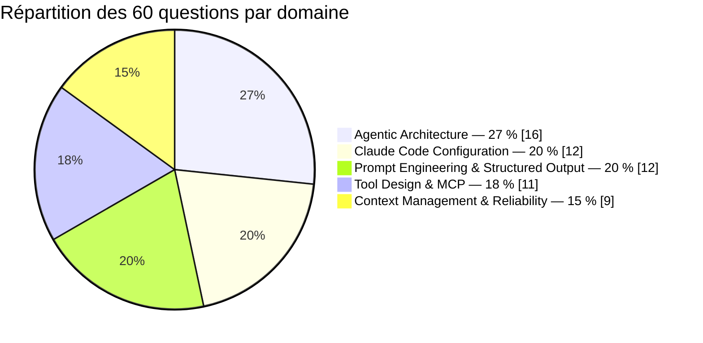

# Test blanc — Claude Certified Developer – Foundations (CCDV-F)

Ce test blanc reproduit le **format réel** de l'examen **Claude Certified Developer –
Foundations (CCDV-F)**, délivré par Anthropic via **Pearson VUE**. La règle du jeu : si tu
le réussis dans les mêmes conditions que le vrai examen (temps limité, sans recherche, sans
pause), tu es prêt·e à réserver ta session et à valider la certification.

## 1. Le format réel de l'examen

| | |
|---|---|
| Nombre de questions | **60** |
| Durée | **120 minutes** (2 h) |
| Score | Échelle **100 à 1000** |
| Seuil de réussite | **720 / 1000**, soit environ **72 %** — c'est-à-dire viser **~43 bonnes réponses sur 60** |
| Type de réponse | QCM à **une seule bonne réponse**, scénarios développeur |
| Centre d'examen | **Pearson VUE** (sur site ou surveillance à distance) |

> **CCDV-F, pas CCA-F** — deux certifications Claude existent : **CCDV-F** (*Developer –
> Foundations*, celle-ci) teste ta capacité à **implémenter, intégrer, déboguer et opérer**
> des systèmes construits avec Claude ; **CCA-F** (*Architect – Foundations*, testée dans
> l'autre test blanc de ce parcours) teste plutôt la **conception** d'architectures. Les
> deux partagent les mêmes 5 domaines de connaissance, mais **l'angle des questions
> diffère** — voir section 3.

## 2. Les 5 domaines de l'examen (et leur poids)

| Domaine officiel CCDV-F | Poids | Question type | Questions dans ce test |
|---|---|---|---|
| **Agentic Architecture** | 27 % | Agent vs workflow vs appel simple, boucle agentique et `stop_reason`, les 4 façons de construire un agent, sous-agents, anti-boucles | 16 |
| **Claude Code Configuration** | 20 % | `CLAUDE.md` (portées), skills/slash commands, sous-agents personnalisés, hooks, permissions, MCP, mode headless | 12 |
| **Prompt Engineering & Structured Output** | 20 % | `output_config.format`, `strict: true`, few-shot, system vs user, préfills supprimés, multi-pass | 12 |
| **Tool Design & MCP** | 18 % | Description d'outil prescriptive, `tool_choice`, appels parallèles, `is_error`, MCP (transports, conception), tool search | 11 |
| **Context Management & Reliability** | 15 % | Prompt caching, `count_tokens`, RAG vs long contexte, compaction/context editing/memory, modèles/coûts, fiabilité | 9 |

> Repère : **Agentic Architecture pèse le plus lourd** (plus d'1 question sur 4). C'est
> aussi le domaine où le piège n°1 revient le plus souvent : construire un agent (boucle
> autonome, plusieurs outils) là où un appel simple ou un workflow déterministe suffisait.
> Résister à l'over-engineering est autant testé que la maîtrise technique elle-même.

## 3. L'angle développeur : implémenter, pas concevoir

Contrairement à un examen d'architecture qui demande « quelle architecture choisir pour ce
besoin ? », le CCDV-F pose presque toujours une question **d'implémentation, d'intégration,
de débogage ou d'exploitation** :

- **Implémenter** — quel paramètre d'API poser, quel champ de front-matter renseigner, quel
  code écrire pour obtenir tel comportement.
- **Intégrer** — comment connecter un outil, un serveur MCP, un hook, une CI, sans casser un
  mécanisme existant (cache, permissions, reproductibilité).
- **Déboguer** — un scénario décrit un **symptôme observé en production** (le cache ne
  matche jamais, l'outil est mal choisi, la boucle ne s'arrête pas, la latence explose) : il
  faut identifier la **cause structurelle** et la **correction précise**, pas une piste
  vague.
- **Opérer** — coût, fiabilité, temps de réponse : des décisions de exploitation au
  quotidien (Batches API, retry, streaming, choix de modèle) plutôt que des choix de design
  amont.

> **Repère** — si une question te semble demander « comment ferais-tu tourner cette
> fonctionnalité en production, là, maintenant, avec le code/la config que tu as sous les
> yeux ? », tu es exactement dans l'angle CCDV-F.

## 4. La règle d'or : chercher le choix STRUCTUREL

Le piège le plus fréquent de l'examen : une option qui **semble** raisonnable parce qu'elle
ajoute une instruction bien intentionnée dans un prompt (« demande-lui d'être prudent »,
« répète la consigne trois fois », « ajoute un rappel en fin de message »). Ce type de
réponse reste **probabiliste** — il dépend du bon vouloir du modèle à chaque appel — et
n'est **presque jamais** la bonne réponse à l'examen.

La bonne réponse est presque toujours un **choix structurel** : un **paramètre d'API**
(`output_config.format`, `strict: true`, `tool_choice`, `cache_control`, `max_iterations`),
un **pattern de code** (retry/backoff applicatif, boucle bornée, validation côté client), ou
une **configuration** (`tools:` restreint dans un front-matter, un hook `PreToolUse`, une
portée de fichier) — quelque chose qui **garantit** un comportement plutôt que de
l'espérer.

> **Réflexe à l'examen** — face à deux options qui semblent toutes deux « raisonnables »,
> élimine d'abord celle qui repose sur une formulation de prompt (« insister », « rappeler »,
> « demander gentiment ») au profit de celle qui repose sur un mécanisme garanti par
> l'API/le code/la configuration. C'est quasi systématiquement le bon départage.

## 5. Stratégie de gestion du temps

- **120 minutes / 60 questions = 2 minutes par question.** Si un scénario te prend plus de
  2-3 minutes à trancher, **marque-le mentalement** (ou note son numéro sur un brouillon) et
  **passe au suivant** — tu pourras y revenir à la fin.
- Fais un **premier passage complet** en répondant à tout ce qui te semble clair. Ne laisse
  jamais une question sans réponse : élimine les distracteurs les plus absurdes et choisis
  la moins mauvaise option plutôt que de passer sans répondre.
- Garde **15-20 minutes** en fin de session pour revenir sur les questions les plus
  ambiguës.
- Le premier instinct est souvent le bon : ne change une réponse que si tu as identifié un
  élément précis du scénario que tu avais mal lu la première fois.

## 6. Consigne pour ce test blanc

1. Passe-le **en une seule fois**, sans pause, sans recherche externe, **chronométré à
   120 minutes**.
2. Réponds aux **60 questions**, dans l'ordre.
3. Vise **au moins 43 / 60** (≈ 72 %, le seuil réel de réussite du CCDV-F).
4. Une fois terminé, relis **toutes les explications**, y compris celles des questions
   réussies — chaque distracteur explique pourquoi une option, pourtant plausible en
   apparence, ne répond pas exactement au besoin structurel du scénario.

Si tu valides ce test dans ces conditions, tu es prêt·e à réserver ta session d'examen
réelle CCDV-F. Bonne chance.
