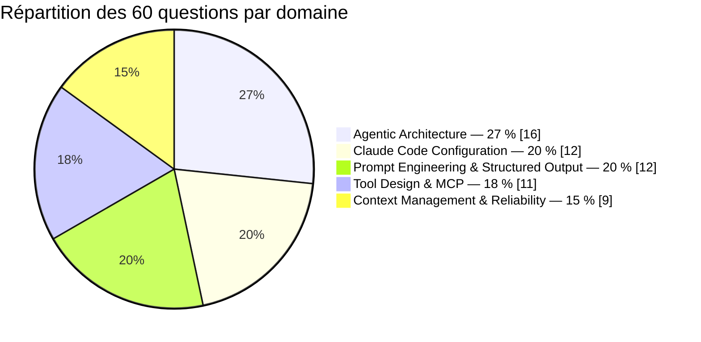

# Test blanc — Claude Certified Architect – Foundations (CCA-F)

Ce test blanc reproduit le **format réel** de l'examen **Claude Certified Architect –
Foundations (CCA-F)**, délivré par Anthropic via **Pearson VUE**. La règle du jeu : si tu
le réussis dans les mêmes conditions que le vrai examen (temps limité, sans recherche, sans
pause), tu es prêt·e à réserver ta session et à valider la certification.

## 1. Le format réel de l'examen

| | |
|---|---|
| Nombre de questions | **60** |
| Durée | **120 minutes** (2 h) |
| Score | Échelle **100 à 1000** |
| Seuil de réussite | **720 / 1000**, soit environ **72 %** — c'est-à-dire viser **~43 bonnes réponses sur 60** |
| Type de réponse | QCM à **une seule bonne réponse**, scénarios d'architecture |
| Centre d'examen | **Pearson VUE** (sur site ou surveillance à distance) |

> **CCA-F, pas CCDV-F** — deux certifications Claude existent : **CCDV-F** (*Developer –
> Foundations*, testée dans l'autre test blanc de ce parcours) évalue ta capacité à
> **implémenter, intégrer, déboguer et opérer** ; **CCA-F** (*Architect – Foundations*,
> celle-ci) évalue plutôt ta capacité à **concevoir** — choisir entre plusieurs
> architectures possibles, et justifier le compromis retenu. Les deux partagent les mêmes 5
> domaines de connaissance, mais **l'angle des questions diffère** — voir section 3.

## 2. Les 5 domaines de l'examen (et leur poids)

| Domaine officiel CCA-F | Poids | Question type (angle architecte) | Questions dans ce test |
|---|---|---|---|
| **Agentic Architecture** | 27 % | Agent vs workflow vs appel simple à l'échelle d'un système, choix entre les 4 façons de construire un agent selon des contraintes d'hébergement/gouvernance, patterns orchestrateur/sous-agents (fan-out, planification dynamique, quand ne pas déléguer), anti-boucles et gates d'escalade comme politique de plateforme | 16 |
| **Claude Code Configuration** | 20 % | Où vivent, pour une équipe ou une organisation entière, le `CLAUDE.md`, les skills, les hooks (CI vs local), les permissions par rôle, `.mcp.json` — conception de la gouvernance, pas juste le nom d'un fichier | 12 |
| **Prompt Engineering & Structured Output** | 20 % | `output_config.format`/`strict` comme **contrat** entre services, quand un pipeline multi-pass se justifie à l'échelle (coût vs qualité), architecture de prompt système partagé entre plusieurs agents | 12 |
| **Tool Design & MCP** | 18 % | Granularité et gouvernance des descriptions d'outils à l'échelle d'une organisation, tool search au-delà de N outils comme principe de conception, un serveur MCP par domaine métier vs monolithe, auth à moindre privilège pour une flotte d'agents | 11 |
| **Context Management & Reliability** | 15 % | Stratégie de caching à l'échelle d'une flotte (préfixe partagé, coût amorti), RAG vs long contexte selon la taille/fraîcheur du corpus, compaction/context editing/memory combinés pour un agent long-running, choix de modèles par étage, Batches, observabilité | 9 |

> Repère : **Agentic Architecture pèse le plus lourd** (plus d'1 question sur 4), exactement
> comme au CCDV-F — c'est le socle commun aux deux certifications. Ce qui change, c'est la
> question posée sur ce socle : pas « quel paramètre coder » mais « quelle architecture
> choisir, et pourquoi ce compromis plutôt qu'un autre ».

## 3. L'angle architecte : concevoir, pas implémenter

Contrairement à un examen développeur qui demande « quel paramètre d'API poser pour obtenir
ce comportement ? », le CCA-F pose presque toujours une question de **conception de
système** :

- **Choisir une architecture** — agent, workflow ou appel simple ; laquelle des 4 façons de
  construire un agent ; RAG ou long contexte ; un serveur MCP par domaine ou un monolithe.
- **Arbitrer un compromis structurel** — coût vs qualité (multi-pass, choix de modèle par
  étage), latence vs fiabilité (asynchrone, Batches), autonomie vs coût d'erreur
  (escalade humaine, gates sur les actions destructives).
- **Gouverner une équipe ou une organisation** — où vivent les conventions Claude Code
  partagées (CLAUDE.md, skills, hooks CI vs locaux, permissions par rôle), comment un
  contrat de sortie structuré est partagé entre plusieurs services, comment une politique de
  sécurité s'applique à toute une flotte d'agents sans dépendre de la discipline de chaque
  équipe.
- **Dimensionner à l'échelle** — caching partagé entre des milliers de sessions, tool search
  au-delà de 30-50 outils, pagination d'un serveur MCP consommé par des dizaines d'agents,
  observabilité d'une flotte en production.

> **Repère** — si une question te semble demander « quelle architecture concevrais-tu pour
> ce système, compte tenu de ces contraintes (échelle, gouvernance, coût, fiabilité) ? », tu
> es exactement dans l'angle CCA-F.

### Les familles de scénarios documentées de l'examen réel

L'examen réel s'appuie sur des familles de scénarios récurrentes, à reconnaître dès les
premières phrases de l'énoncé :

1. **Customer Support Agent** — résolution autonome d'une partie des demandes, escalade
   humaine du reste.
2. **Claude Code Configuration (équipe)** — gouvernance de la configuration partagée par
   plusieurs développeurs ou plusieurs équipes.
3. **Multi-Agent Research System** — un orchestrateur qui décompose une recherche en
   sous-tâches (`search` → `analyze` → `synthesize`), séquentielles, parallèles ou
   planifiées dynamiquement.
4. **Developer Productivity Tools** — outils intégrés + MCP au service d'un produit ou
   d'une équipe d'ingénierie.
5. **CI/CD code review** — un harnais de revue automatisée intégré à un pipeline
   d'intégration continue.
6. **Structured Data Extraction** — un pipeline d'extraction à fort volume, avec des
   contraintes de coût, de fraîcheur et de contrat de sortie entre étapes.

## 4. La règle d'or : chercher le choix STRUCTUREL d'ARCHITECTURE

Le piège le plus fréquent de l'examen reste le même qu'au CCDV-F : une option qui **semble**
raisonnable parce qu'elle ajoute une instruction bien intentionnée dans un prompt
(« demande-lui d'être prudent », « précise-lui que c'est important »). Ce type de réponse
reste **probabiliste** et n'est **presque jamais** la bonne réponse.

Mais au CCA-F, la bonne réponse n'est pas seulement un paramètre isolé : c'est un **choix
structurel d'architecture** — quel composant du système porte la garantie recherchée (un
workflow plutôt qu'un agent, un gate humain plutôt qu'une consigne, un schéma de sortie
partagé plutôt qu'un accord tacite entre équipes, un serveur MCP par domaine plutôt qu'un
monolithe, une politique de plateforme plutôt qu'une bonne pratique individuelle). Une
option qui répond à l'échelle d'**un seul appel** quand le scénario décrit une **flotte**,
une **équipe** ou un **pipeline à fort volume** est presque toujours insuffisante.

> **Réflexe à l'examen** — face à deux options toutes deux « raisonnables » à l'échelle
> d'un seul appel, demande-toi laquelle **tient toujours** quand on la déploie sur des
> dizaines d'agents, des centaines de sessions ou plusieurs équipes. C'est quasi
> systématiquement le bon départage entre une réponse développeur et une réponse architecte.

## 5. Stratégie de gestion du temps

- **120 minutes / 60 questions = 2 minutes par question.** Un scénario d'architecture peut
  être long à lire ; ne te laisse pas intimider par sa longueur, isole la contrainte
  structurelle réelle derrière le narratif.
- Fais un **premier passage complet**, réponds à tout ce qui te semble clair, marque
  mentalement (ou sur un brouillon) les questions ambiguës pour y revenir.
- Garde **15-20 minutes** en fin de session pour les questions les plus disputées.
- Le premier instinct est souvent le bon : ne change une réponse que si tu identifies un
  élément précis du scénario (une contrainte d'échelle, de gouvernance ou de coût d'erreur)
  que tu avais mal lu la première fois.

## 6. Consigne pour ce test blanc

1. Passe-le **en une seule fois**, sans pause, sans recherche externe, **chronométré à
   120 minutes**.
2. Réponds aux **60 questions**, dans l'ordre.
3. Vise **au moins 43 / 60** (≈ 72 %, le seuil réel de réussite du CCA-F).
4. Une fois terminé, relis **toutes les explications**, y compris celles des questions
   réussies — chaque distracteur explique pourquoi une option, pourtant plausible en
   apparence à l'échelle d'un seul appel ou d'une seule équipe, ne tient pas structurellement
   à l'échelle du système décrit.

Si tu valides ce test dans ces conditions, tu es prêt·e à réserver ta session d'examen
réelle CCA-F. Bonne chance.
