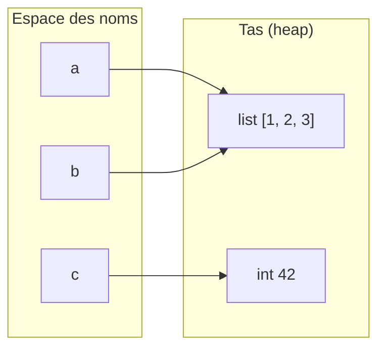

## Le concept

Une fonction regroupe une logique réutilisable. On la définit avec `def`, on la documente avec des annotations de type, on en sort avec `return` :

```python
def saluer(nom: str, politesse: str = "Hello") -> str:
    return f"{politesse}, {nom} !"
```

- `politesse: str = "Bonjour"` est un **paramètre avec valeur par défaut** : on peut l'omettre à l'appel.
- On peut passer les arguments **par position** (`saluer("Ada")`) ou **par nom** (`saluer(nom="Ada")`). Les arguments nommés rendent l'appel auto-documenté.

## `*args`, `**kwargs` et `lambda`

Quand le nombre d'arguments est variable :

- **`*args`** capture les arguments **positionnels** restants dans un **tuple**.
- **`**kwargs`** capture les arguments **nommés** restants dans un **dict**.

```python
def somme(*nombres):        # somme(1, 2, 3) -> nombres = (1, 2, 3)
    return sum(nombres)

def config(**options):      # config(debug=True) -> options = {"debug": True}
    ...
```

Une **lambda** est une fonction anonyme d'une seule expression, surtout utile comme paramètre (`sorted(..., key=lambda x: ...)`).

> **Le piège n°1 des débutants : la valeur par défaut mutable.** `def f(x, panier=[])` partage **la même liste** entre tous les appels — un bug vicieux. La parade : `panier=None` puis `if panier is None: panier = []`.

```python
# Unpacking at call time: * spreads a list, ** spreads a dict
def point(x, y, z):
    return (x, y, z)

coords = [1, 2, 3]
point(*coords)            # equivalent to point(1, 2, 3)

params = {"x": 1, "y": 2, "z": 3}
point(**params)           # equivalent to point(x=1, y=2, z=3)

# A function is an object: you can pass it as an argument
def appliquer(fn, valeur):
    return fn(valeur)

appliquer(str.upper, "ada")   # "ADA"
```

---

## Modèle mémoire : tout est une référence

En Python, **chaque variable est une étiquette** posée sur un objet en mémoire. Assigner `b = a` ne copie pas l'objet — les deux étiquettes pointent vers le même endroit.



`a` et `b` pointent vers la **même** liste : `a.append(4)` se voit aussi via `b`. En revanche, `c = 100` repointe `c` vers un nouvel entier — l'objet `42` reste intact.

### `is` vs `==` — ne jamais confondre

| Opérateur | Question posée | Règle d'or |
|-----------|----------------|------------|
| `==` | Même **valeur** ? | Toujours pour les données |
| `is` | Même **identité** (objet en mémoire) ? | Uniquement `None`, `True`, `False` |

```python
a = [1, 2, 3]
b = [1, 2, 3]

print(a == b)    # True  — equal values
print(a is b)    # False — two distinct objects in memory

x = None
if x is None:    # correct: PEP 8 recommends 'is' for None
    pass
if x == None:    # works, but linters flag it — avoid
    pass
```

> Python met en cache les petits entiers (`-5` à `256`) et certaines chaînes. `256 is 256` peut être `True` par accident d'implémentation CPython, jamais par contrat du langage. N'écris jamais `n is 42`.

---

## Comparaison PHP / JS → Python : fonctions

| Concept | PHP | JavaScript ES6 | Python |
|---------|-----|----------------|--------|
| Fonction nommée | `function f($x) { }` | `function f(x) { }` | `def f(x):` |
| Anonyme / lambda | `fn($x) => expr` | `(x) => expr` | `lambda x: expr` |
| Capture de closure | `use ($var)` explicite | automatique | automatique |
| Variadic | `...$args` | `...args` | `*args` / `**kwargs` |
| Argument nommé | PHP 8 : `f(a: 1)` | pas natif | `f(a=1)` |
| Décorateur | `#[Attribute]` (PHP 8) | plugin Babel | `@decorator` natif |
| Valeur par défaut | `$x = 42` | `x = 42` | `x=42` |

> La **lambda Python est volontairement limitée à une expression**. Pour une logique multi-lignes, déclare une vraie `def` — c'est une convention stylistique assumée par la communauté, pas une contrainte technique.

---

## Pythonismes : comprehensions et décorateurs

### List / dict comprehensions

```python
# ---- verbose loop (PHP/JS reflex) ----
squares = []
for i in range(10):
    squares.append(i * i)

# ---- list comprehension (Pythonic) ----
squares = [i * i for i in range(10)]
evens   = [x for x in range(20) if x % 2 == 0]   # with filter

# ---- dict comprehension ----
words     = ["cat", "elephant", "ox"]
length_of = {w: len(w) for w in words}
# {"cat": 3, "elephant": 8, "ox": 2}

# ---- flatten a 2D matrix ----
matrix  = [[1, 2], [3, 4], [5, 6]]
flatten = [x for row in matrix for x in row]   # [1, 2, 3, 4, 5, 6]
```

### Décorateurs — pas à pas

Un décorateur est une fonction qui **enveloppe** une autre fonction pour lui greffer un comportement. `@timer` est du sucre syntaxique pour `compute = timer(compute)`.

```python
import time
import functools

def timer(func):
    @functools.wraps(func)      # preserves __name__, __doc__, __module__
    def wrapper(*args, **kwargs):
        t0     = time.perf_counter()
        result = func(*args, **kwargs)
        print(f"  {func.__name__}() took {time.perf_counter() - t0:.4f}s")
        return result
    return wrapper

@timer                          # sugar for: compute = timer(compute)
def compute(n: int) -> int:
    return sum(range(n))

compute(1_000_000)
```

> **À retenir :**
> - `[expr for x in it if cond]` plutôt qu'un `for` + `append` — plus lisible, souvent plus rapide.
> - `{k: v for k, v in pairs}` plutôt qu'un dict vide + boucle.
> - Dans tout décorateur : `@functools.wraps(func)` pour préserver les métadonnées de la fonction enveloppée.
> - `is` uniquement pour `None`, `True`, `False` ; `==` pour toute comparaison de valeurs.

## Bac à sable

> Remplace panier=None par panier=[] (le mauvais réflexe) et relance ajouter('a') puis ajouter('b') pour voir la liste partagée grandir. Puis remets None.

```python
# Functions: parameters, defaults, *args, **kwargs, lambda

def saluer(nom: str, politesse: str = "Hello") -> str:
    return f"{politesse}, {nom} !"

print(saluer("Ada"))                      # default "Hello"
print(saluer("Linus", politesse="Hi"))  # keyword argument

# *args: variable number of positional arguments (received as a tuple)
def somme(*nombres: int) -> int:
    total = 0
    for n in nombres:
        total += n
    return total

print("somme(1,2,3,4) =", somme(1, 2, 3, 4))

# **kwargs: variable number of keyword arguments (received as a dict)
def profil(**infos: str) -> None:
    for cle, valeur in infos.items():
        print(f"   {cle} = {valeur}")

print("profile:")
profil(nom="Ada", ville="London")

# lambda: small anonymous function, ideal as the 'key' parameter
nombres = [5, 2, 9, 1, 7]
print("sorted descending:", sorted(nombres, key=lambda x: -x))

# TRAP: NEVER use a mutable object as a default value
def ajouter(item, panier=None):
    if panier is None:   # good reflex
        panier = []
    panier.append(item)
    return panier

print(ajouter("a"))   # ['a']
print(ajouter("b"))   # ['b']  (and NOT ['a', 'b']!)
```
