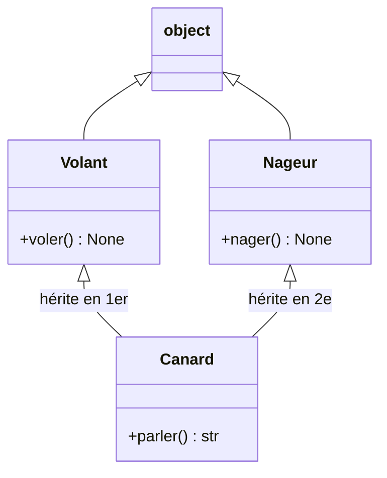

## Le concept

Une **classe** est un patron qui réunit des **données** (attributs) et des **comportements** (méthodes). `__init__` est le constructeur ; `self` est l'instance courante :

```python
class CompteBancaire:
    def __init__(self, titulaire: str, solde: float = 0.0) -> None:
        self.titulaire = titulaire   # instance attribute
        self.solde = solde

    def deposer(self, montant: float) -> None:
        self.solde += montant
```

`__repr__` définit l'affichage lisible d'une instance (utile en debug). On crée une instance en "appelant" la classe : `c = CompteBancaire("Ada")`.

## Les dataclasses : moins de plomberie

Quand une classe ne sert qu'à **transporter des données**, écrire `__init__`, `__repr__` et `__eq__` à la main est répétitif. Le décorateur `@dataclass` les **génère pour toi** à partir des annotations :

```python
from dataclasses import dataclass

@dataclass(frozen=True)
class Point:
    x: float
    y: float
```

- `frozen=True` rend l'instance **immuable** (toute réaffectation lève `FrozenInstanceError`).
- L'égalité `==` compare alors **par valeur** : `Point(3, 4) == Point(3, 4)` est `True`.

> **Défaut muable dans une dataclass.** Interdit d'écrire `articles: list = []` (même piège que les fonctions). Utilise `field(default_factory=list)`, qui crée une liste **neuve** par instance.

L'**héritage** permet à `CompteEpargne` de réutiliser `CompteBancaire` ; `super().__init__(...)` appelle le constructeur parent.

```python
# Common special (dunder) methods
class Vecteur:
    def __init__(self, x, y):
        self.x, self.y = x, y

    def __add__(self, autre):           # overloads the + operator
        return Vecteur(self.x + autre.x, self.y + autre.y)

    def __eq__(self, autre):            # equality by value
        return (self.x, self.y) == (autre.x, autre.y)

Vecteur(1, 2) + Vecteur(3, 4)   # Vecteur(4, 6)

# Class attribute (shared) vs instance attribute (own)
class Chien:
    espece = "Canis"          # shared by all instances
    def __init__(self, nom):
        self.nom = nom         # own to each instance
```

---

## Comparaison PHP / JS → Python : les classes

| Concept | PHP | JavaScript ES6 | Python |
|---------|-----|----------------|--------|
| Déclaration | `class Foo { }` | `class Foo { }` | `class Foo:` |
| Constructeur | `__construct(...)` | `constructor(...)` | `__init__(self, ...)` |
| Instance courante | `$this` | `this` | `self` (premier paramètre explicite) |
| Héritage | `class B extends A` | `class B extends A` | `class B(A):` |
| Super constructeur | `parent::__construct(...)` | `super(...)` | `super().__init__(...)` |
| Membre privé | `private $x` | `#x` (ES2022) | `_x` (convention) / `__x` (name mangling) |
| Méthode statique | `static function f()` | `static f()` | `@staticmethod` |
| Attribut de classe | `static $x = val` | `static x = val` | `nom = val` au niveau classe |
| Interface / Abstract | `interface I` / `abstract class A` | pas natif | `abc.ABC` + `@abstractmethod` |

> En Python, il n'y a pas de vrai `private` : `__attr` déclenche le *name mangling* (renommé `_ClassName__attr`) pour éviter les collisions en héritage, mais ce n'est pas une barrière de sécurité. La convention communautaire est `_attr` pour signaler « usage interne ».

---

## MRO : l'ordre de résolution des méthodes

En **héritage multiple**, Python doit choisir quelle méthode appeler. Il utilise l'algorithme **C3 linearization** pour calculer le **MRO (Method Resolution Order)**.



```python
class Volant:
    def decrire(self):
        return "I fly"

class Nageur:
    def decrire(self):
        return "I swim"

class Canard(Volant, Nageur):   # MRO: Canard → Volant → Nageur → object
    pass

print(Canard().decrire())    # "I fly" — Volant found first in MRO
print(Canard.__mro__)        # inspect the full resolution order
```

La méthode est cherchée **de gauche à droite** dans la liste des parents, en évitant les doublons. `super()` suit ce même MRO — pas forcément le parent direct.

> **Piège `super()` en héritage multiple.** `super()` désigne la *prochaine* classe dans le MRO, pas le parent déclaré. Pour que chaque `__init__` de la hiérarchie soit exécuté, toutes les classes doivent appeler `super().__init__(...)` — sinon certains constructeurs sont silencieusement sautés.

---

## Dunder methods courants

Les **méthodes spéciales** (dunder = double underscore) permettent à tes classes de s'intégrer dans les idiomes Python : opérateurs, affichage, itération, contexte.

| Méthode | Déclenchée par | Utilisation typique |
|---------|----------------|---------------------|
| `__init__(self, ...)` | `Foo(...)` | Constructeur |
| `__repr__(self)` | `repr(obj)`, shell interactif | Affichage non ambigu (debug) |
| `__str__(self)` | `str(obj)`, `print(obj)` | Affichage lisible |
| `__len__(self)` | `len(obj)` | Taille d'un conteneur |
| `__getitem__(self, key)` | `obj[key]` | Accès indexé |
| `__iter__(self)` | `for x in obj` | Rend l'objet itérable |
| `__contains__(self, item)` | `x in obj` | Test d'appartenance |
| `__add__(self, other)` | `a + b` | Surcharge de `+` |
| `__eq__(self, other)` | `a == b` | Égalité par valeur |
| `__lt__(self, other)` | `a < b` | Comparaison (active `sorted`) |
| `__enter__ / __exit__` | `with obj as x:` | Context manager |
| `__call__(self, ...)` | `obj(...)` | Instance appelable comme fonction |

```python
class Temperature:
    def __init__(self, celsius: float) -> None:
        self._c = celsius

    def __repr__(self) -> str:
        return f"Temperature({self._c}°C)"

    def __add__(self, other: "Temperature") -> "Temperature":
        return Temperature(self._c + other._c)

    def __lt__(self, other: "Temperature") -> bool:
        return self._c < other._c

t1 = Temperature(20)
t2 = Temperature(5)
print(t1 + t2)            # Temperature(25°C)
print(sorted([t1, t2]))   # [Temperature(5°C), Temperature(20°C)]
```

## Bac à sable

> Ajoute une méthode retirer(montant) à CompteBancaire, ou enlève frozen=True de Point puis fais p.x = 99 pour voir la différence.

```python
# Classes & dataclasses
from dataclasses import dataclass, field

# Classic class: __init__ for state, methods for behavior
class CompteBancaire:
    def __init__(self, titulaire: str, solde: float = 0.0) -> None:
        self.titulaire = titulaire
        self.solde = solde

    def deposer(self, montant: float) -> None:
        self.solde += montant

    def __repr__(self) -> str:           # readable display
        return f"CompteBancaire({self.titulaire!r}, solde={self.solde})"

c = CompteBancaire("Ada")
c.deposer(100)
c.deposer(50)
print(c)

# dataclass: __init__, __repr__ and __eq__ generated automatically
@dataclass(frozen=True)   # frozen => immutable instance
class Point:
    x: float
    y: float

    def distance_origine(self) -> float:
        return (self.x ** 2 + self.y ** 2) ** 0.5

p = Point(3.0, 4.0)
print("dataclass     :", p)
print("distance      :", p.distance_origine())
print("value equality:", Point(3.0, 4.0) == Point(3.0, 4.0))   # True!

try:
    p.x = 99   # frozen forbids the mutation
except Exception as exc:
    print("frozen blocks:", type(exc).__name__)

# default_factory: SAFE mutable default for a dataclass
@dataclass
class Panier:
    articles: list[str] = field(default_factory=list)

panier = Panier()
panier.articles.append("bread")
print("default_factory:", panier)

# Inheritance + super()
class CompteEpargne(CompteBancaire):
    def __init__(self, titulaire: str, taux: float) -> None:
        super().__init__(titulaire)
        self.taux = taux

    def appliquer_interets(self) -> None:
        self.solde *= (1 + self.taux)

e = CompteEpargne("Linus", 0.05)
e.deposer(1000)
e.appliquer_interets()
print("savings       :", e, "| rate", e.taux)
```
