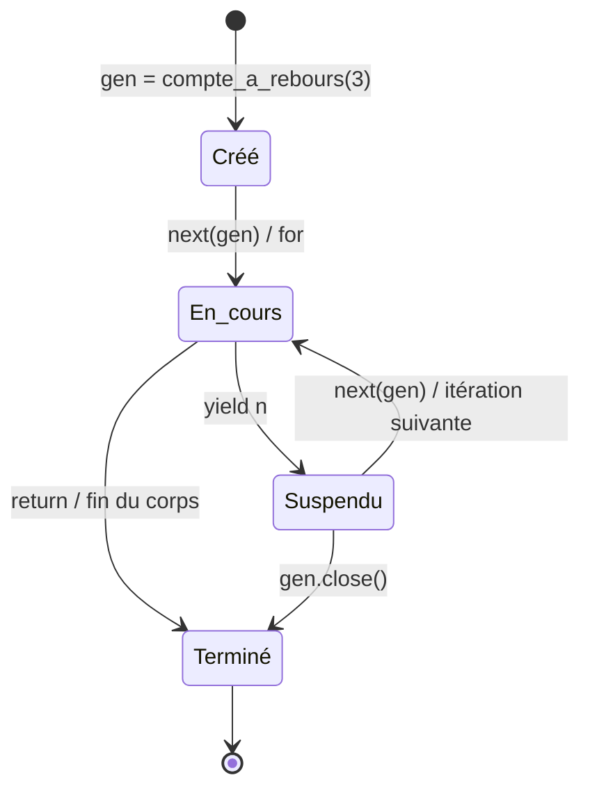

## Le concept

Tout ce que tu parcours avec `for` est **itérable**. Sous le capot, Python obtient un **itérateur** (via `__iter__`) puis appelle `__next__` jusqu'à ce qu'il lève `StopIteration`.

Tu peux écrire un itérateur à la main, mais c'est verbeux. La voie royale, c'est le **générateur** : une fonction qui utilise `yield` au lieu de `return`.

```python
def compte_a_rebours(n):
    while n > 0:
        yield n      # returns a value THEN pauses the function
        n -= 1

list(compte_a_rebours(3))   # [3, 2, 1]
```

Chaque `yield` **suspend** la fonction et renvoie une valeur ; au `next` suivant, l'exécution **reprend exactement où elle s'était arrêtée**, en conservant ses variables locales.

## Pourquoi : la paresse, c'est de l'efficacité

Un générateur est **paresseux** : il produit les valeurs **une à une, à la demande**, sans jamais matérialiser toute la séquence en mémoire.

```python
# Builds a list of one million elements in memory:
sum([x * x for x in range(1_000_000)])

# Keeps only one value at a time (generator expression):
sum(x * x for x in range(1_000_000))
```

Conséquences pratiques :

- On peut représenter des séquences **infinies** (`fibonacci()`) et n'en consommer que le début.
- On traite des fichiers ou flux **énormes** sans saturer la RAM.
- On compose des **pipelines** paresseux (un générateur qui consomme un autre générateur).

> **`enumerate`** (index + valeur) et **`zip`** (parcours parallèle) sont les compagnons indispensables de toute boucle.

```python
# List vs generator expression
[x * x for x in range(5)]    # list: [0, 1, 4, 9, 16] (all in memory)
(x * x for x in range(5))    # generator: produced on demand

# Lazy pipeline: one generator feeds another
def pairs(it):
    for x in it:
        if x % 2 == 0:
            yield x

list(pairs(range(10)))       # [0, 2, 4, 6, 8]

# itertools: advanced iteration building blocks
import itertools
list(itertools.islice(itertools.count(0, 2), 4))   # [0, 2, 4, 6]
```

---

## Cycle de vie d'un générateur

Un générateur passe par quatre états que tu peux inspecter via `inspect.getgeneratorstate(gen)`.



Les quatre états : **GEN_CREATED** (créé, jamais démarré), **GEN_RUNNING** (en cours d'exécution), **GEN_SUSPENDED** (suspendu sur un `yield`), **GEN_CLOSED** (épuisé ou fermé manuellement).

```python
import inspect

def compte_a_rebours(n: int):
    while n > 0:
        yield n
        n -= 1

gen = compte_a_rebours(3)
print(inspect.getgeneratorstate(gen))   # GEN_CREATED

next(gen)   # first value: 3
print(inspect.getgeneratorstate(gen))   # GEN_SUSPENDED

for _ in gen:   # consume the rest
    pass
print(inspect.getgeneratorstate(gen))   # GEN_CLOSED
```

> **`gen.send(valeur)`** envoie une valeur *dans* le générateur suspendu : elle devient le résultat de l'expression `yield`. C'est la brique fondatrice des coroutines, avant `async/await`.

---

## Context managers : le protocole `with`

Le bloc `with` garantit qu'une **ressource est libérée** à la sortie, même en cas d'exception. Il repose sur deux méthodes dunder : `__enter__` (appelée à l'entrée du bloc) et `__exit__` (appelée à la sortie, même si une exception a été levée).

```python
# File closes automatically at end of 'with', even on exception
with open("data.txt", "w") as f:
    f.write("hello")
# f.close() already guaranteed here

# Build a context manager without a class — @contextmanager is simpler
from contextlib import contextmanager

@contextmanager
def managed_connection(host: str):
    print(f"  opening connection to {host}")
    conn = {"host": host, "open": True}   # simulated resource
    try:
        yield conn              # value bound to the 'as' variable
    finally:
        conn["open"] = False    # cleanup always runs
        print(f"  closing connection to {host}")

with managed_connection("db.local") as c:
    print(f"  working with {c}")
```

**Cas d'usage courants :**

| Context manager | Ce qu'il garantit |
|-----------------|-------------------|
| `open(fichier)` | Fermeture du fichier |
| `threading.Lock()` | Libération du verrou |
| `unittest.mock.patch(...)` | Restauration de l'objet mocké |
| `tempfile.TemporaryDirectory()` | Suppression du dossier temporaire |
| `contextlib.suppress(ExcType)` | Ignorance silencieuse d'une exception ciblée |

> **À retenir :** Chaque fois que tu écris un `try / finally` pour libérer une ressource, demande-toi si un `with` ne le ferait pas plus proprement — c'est précisément pour ça qu'il a été conçu.

## Bac à sable

> Écris un générateur pairs(it) qui ne laisse passer que les nombres pairs, puis fais list(pairs(compte_a_rebours(10))).

```python
# Iterators & generators: producing values on demand

# 1) Hand-written iterator: __iter__ + __next__
class Compteur:
    def __init__(self, limite: int) -> None:
        self.limite = limite
        self.n = 0

    def __iter__(self) -> "Compteur":
        return self

    def __next__(self) -> int:
        if self.n >= self.limite:
            raise StopIteration   # signals the end
        self.n += 1
        return self.n

print("custom iterator  :", list(Compteur(4)))

# 2) Generator: much simpler, using 'yield'
def compte_a_rebours(n: int):
    while n > 0:
        yield n          # pauses, returns a value, resumes here
        n -= 1

print("generator        :", list(compte_a_rebours(5)))

# 3) Infinite generator + lazy consumption
def fibonacci():
    a, b = 0, 1
    while True:          # infinite, but we only take what we want
        yield a
        a, b = b, a + b

gen = fibonacci()
premiers = [next(gen) for _ in range(10)]
print("10 Fibonacci     :", premiers)

# 4) Generator expression: constant memory (no intermediate list)
somme = sum(x * x for x in range(1, 1001))
print("sum of squares   :", somme)

# 5) Everyday iteration tools
for i, lettre in enumerate(["a", "b", "c"], start=1):
    print(f"   {i}: {lettre}")
print("zip:", list(zip([1, 2, 3], ["one", "two", "three"])))
```
